# 1. NestJS & TypeORM 환경에서 Monorepo 구성하기    

지난 시간에 [yarn workspace](https://jojoldu.tistory.com/585) 를 활용한 Monorepo를 소개 드렸는데요.  
이번 시간에는 NodeJS의 대표적인 MVC/DI 프레임워크인 [NestJS](https://docs.nestjs.com/) 를 활용한 모노레포 구성을 진행해보겠습니다.

> 가끔 NestJS를 Spring 프레임워크와 비교하는데요.  
> NestJS는 Spring 중에서도 Spring MVC와 같은 역할을 하는 것이지 Batch / Cloud / Security / Data 등을 모두 지원하는 엔터프라이즈 프레임워크인 **Spring 프레임워크 전체와 비교하기엔 어렵습니다**.  
> 누가 더 뛰어난 프레임워크를 이야기하는건 아니지만, 100% 대칭된다고 보기는 어려워서 오해하시는 분들이 계셔서 먼저 말씀드립니다.

이번 편에서는 TypeORM 등의 다른 프레임워크까지의 통합은 배제하고, NestJS만으로 진행하겠습니다.

> 모든 코드는 [Github](https://github.com/jojoldu/monorepo-nestjs-typeorm) 에 있습니다.

## 1. 프로젝트 구성

직접 모노레포를 구성해도 되지만, NestJS에서는 이미 **CLI로 모노레포 구성**을 지원하기 때문에 CLI로 진행하겠습니다.  
  
아직 NestJS CLI를 설치하지 않으셨다면 아래 명령어로 설치합니다.

```bash
npm install -g @nestjs/cli
```

설치가 다 되셨다면, CLI로 NestJS로 프로젝트를 생성합니다.


```bash
nest new monorepo-nestjs-typeorm
```

그럼 아래와 같이 기본적인 NestJS 프로젝트가 구성됩니다.


## 2. 모듈 추가

이렇게 구성된 프로젝트가 실제 깃헙 저장소와 연결이 될 예정이고,  
이 하위에 각각의 모듈들이 추가될 예정인데요.  
  
전체적인 모듈 구성은 다음과 같이 됩니다.

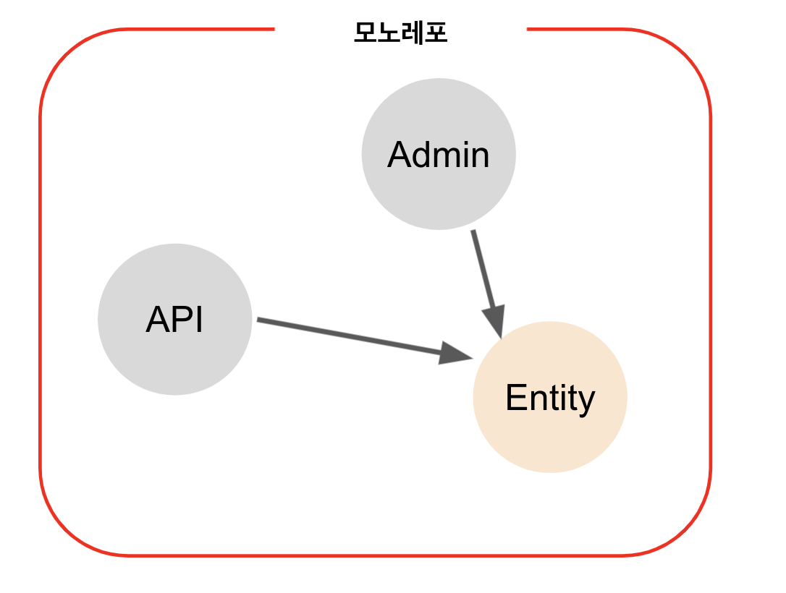

* apps
  * **별도의 서버로 배포될 애플리케이션** 들입니다.
  * 하나 하나가 단독 실행 가능한 모듈입니다.
* libs
  * 공유 라이브러리로 보시면 되는데요.
  * apps 에서 이들을 의존해서 사용합니다.

먼저 애플리케이션으로 사용할 `api` 모듈을 생성해봅니다.

### 2-1. apps 추가

NestJS CLI로 아래와 같이 실행하면 `apps`에 `api` 모듈이 추가됩니다.

```bash
nest g app api
```

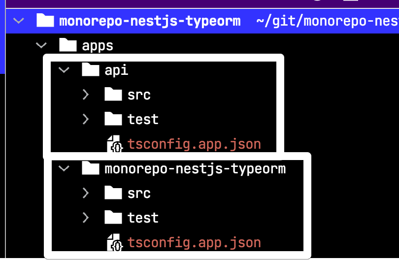

동일한 Workspace 내에서 기존 모듈과 함께 하위 모듈을 생성합니다.    
모노레포 속 하위 모듈들은 동일한 `node_modules` 폴더(단일 버전 정책) 및 구성 파일(예: tsconfig.json및 nest-cli.json)을 공유합니다.  
구성은 공통으로 관리되지만, 실행 및 배포는 별도로 가능합니다.  
  
admin 모듈을 추가해봅니다.

```bash
nest g app admin
```

이렇게 별도로 실행할 app 모듈을 추가했다면,  
이제 이들 app 모듈들이 공통으로 사용할 lib 모듈을 추가해보겠습니다. 

### 2-2. libs 추가

마찬가지로 라이브러리 모듈 생성은 아래 명령으로 가능합니다.

```bash
nest g lib entity
```

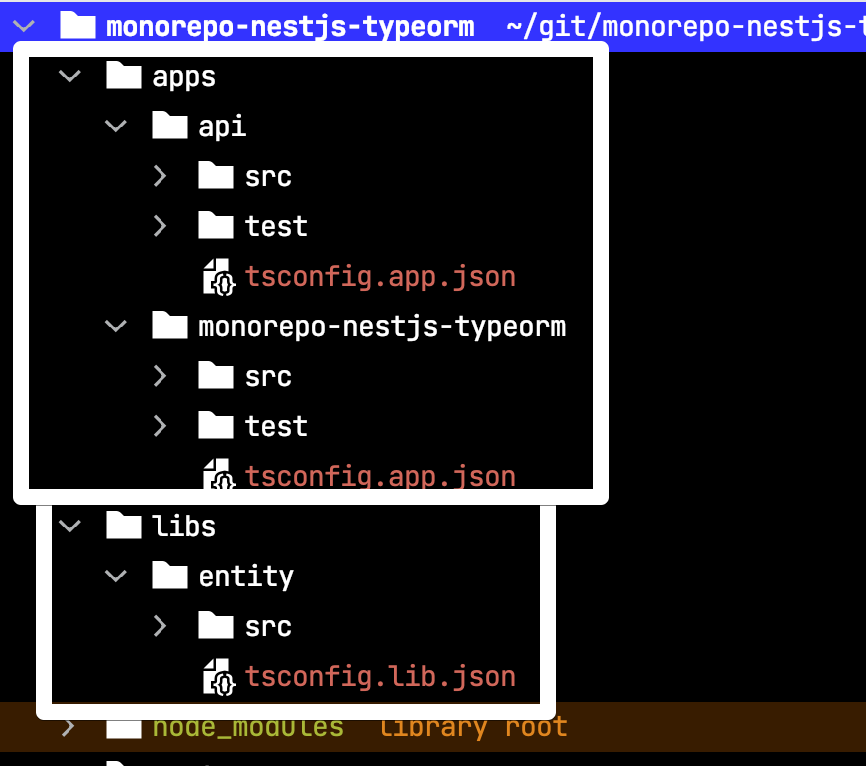


이 두 명령 (`nest g app 모듈명`, `nest g lib 모듈명`) 은 모두 `nest-cli.json` 에서 `projects` 를 **자동으로 업데이트** 해줍니다.
즉, 일반적으로 **내용을 수동으로 편집할 필요는 없습니다**.  
(기본 파일 이름 등을 변경하는 경우 제외).  

> NestJS의 모노레포에 대한 좀 더 상세한 내용은 [공식문서](https://docs.nestjs.com/cli/monorepo) 에서 찾아볼 수 있습니다.

### 2-3. 기존 모듈 제거

이제 `api` 와 `admin` 모듈로 서비스를 할 예정이니, 처음 생성할 때 있었던 모듈은 제거하겠습니다.  
  
제거할 곳은 2군데 입니다.  
  
첫번째는 **모듈 디렉토리** 입니다.

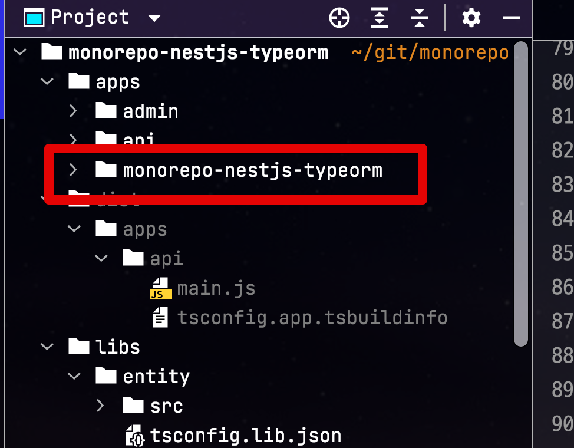

두번째는 `nest-cli.json` 에서 `projects` 에서 모듈 메타데이터 입니다.

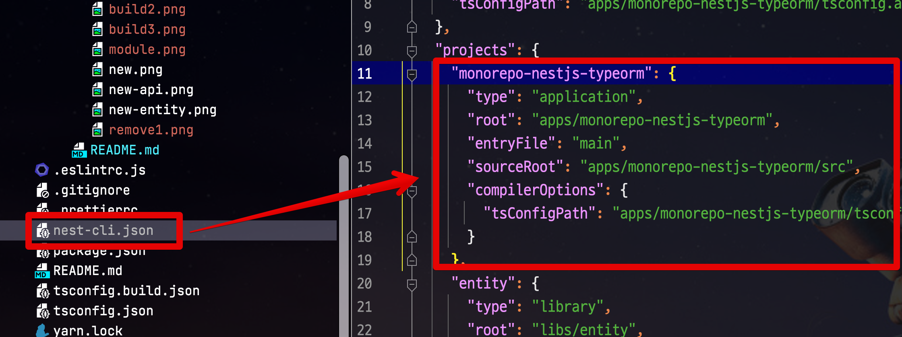

둘 모두 제거 하셨다면, 이제 더이상 해당 모듈은 모노레포 관리 대상이 아니게 됩니다.

## 3. 시작

하위 모듈만 별도로 실행하는 방법은 아래 명령어로 가능합니다.

```bash
nest start api
```

만약 **watch 실행**가 필요하면 다음과 같이 watch로 실행 가능합니다.

```bash
nest start api --watch
```

모듈별 실행도 확인되셨다면, 이제 공통 라이브러리인 `libs/entity` 모듈을 사용해보겠습니다.

### 3-1. libs 모듈 의존성

간단하게 `libs/entity` 의 `entity.service.ts` 파일에 함수를 추가하여, 이를 `api` 모듈이 DI (의존성 주입) 받아 사용하는 코드를 작성해보겠습니다.  
  
**libs/entity/src/entity.service.ts**

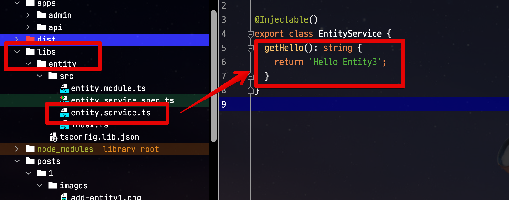

**apps/api/src/api.module.ts**

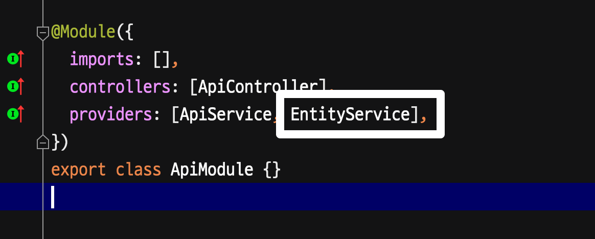

**apps/api/src/api.controller.ts**

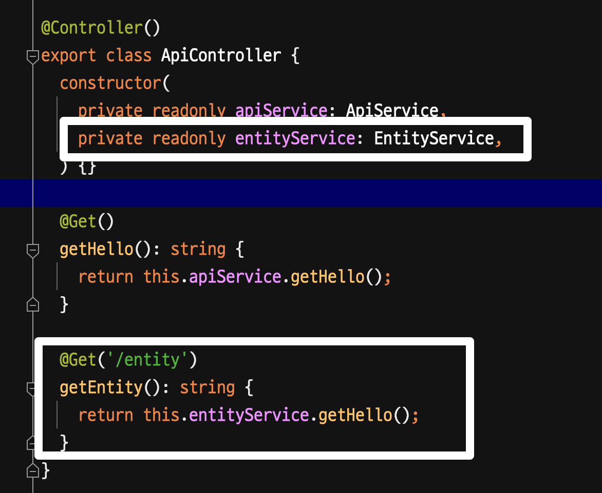

그리고 다시 `api` 모듈을 실행해보면?  

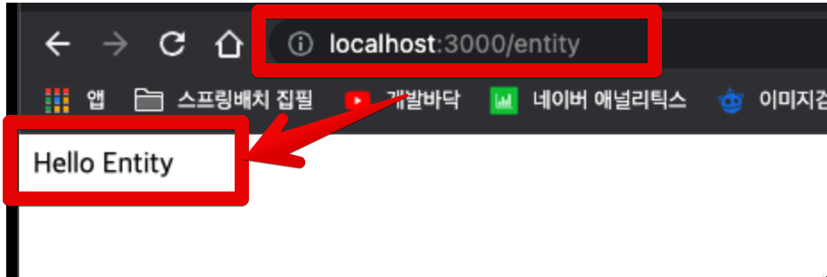

서비스 모듈이 잘 추가되어 사용할 수 있음을 확인할 수 있습니다.

## 4. 빌드

각 모듈별로 배포하기 위해 **모듈별 빌드가 필요할 경우** 아래 명령어로 가능합니다.

```bash
nest build api
```

이렇게 할 경우 아래와 같이 **실행 가능한 단일 파일**이 생성 됩니다.

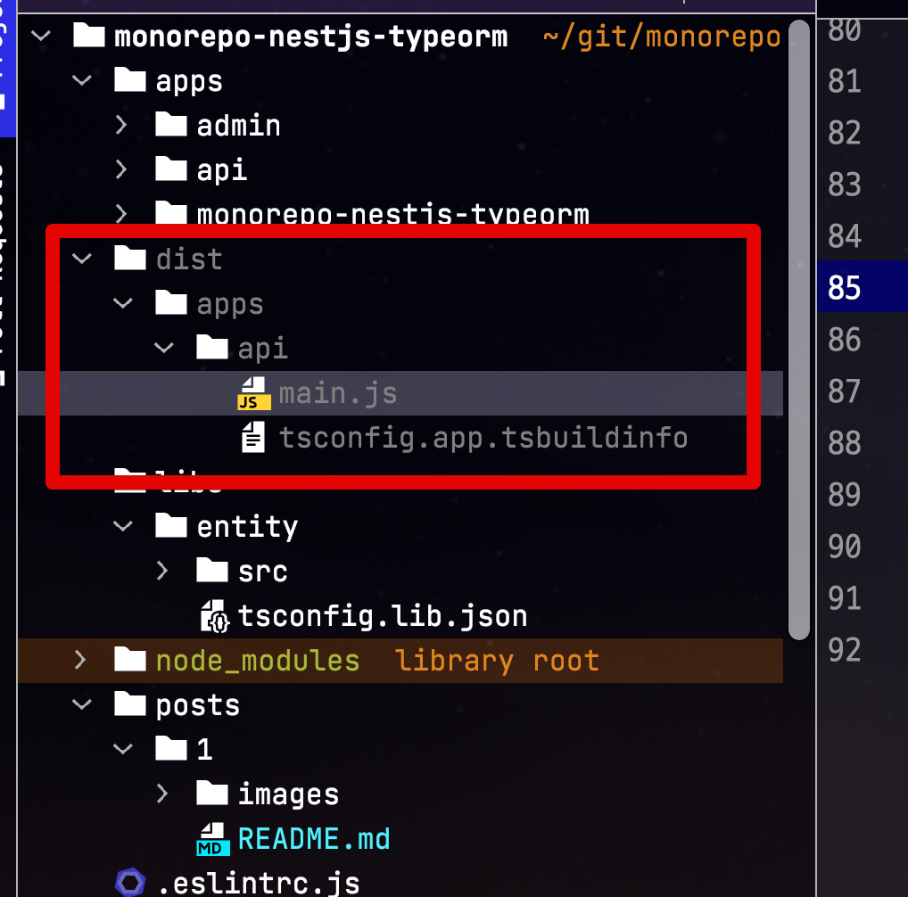

즉, EC2 서버마다 `yarn install`을 할 필요 없이, CI 서버에서 빌드를 끝내고 나면 각 서버들은 이제 해당 단일 파일을 실행만 시키면 됩니다.

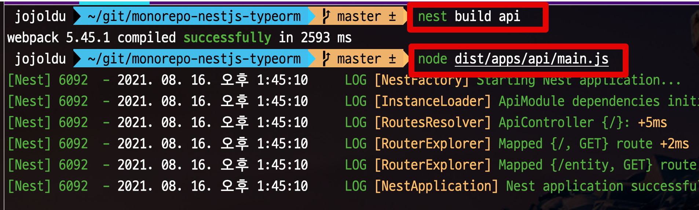

그럼 아래와 같이 정상적으로 앱이 실행된 것을 확인할 수 있습니다.

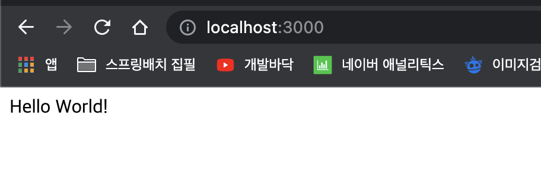

## 5. 마무리

확실히 다른 프레임워크의 모노레포 구성 보다, NodeJS 진영의 모노레포 구성은 쉽다고 생각합니다.  
물론 직접 구성한다면, 훨씬 더 어렵겠지만 워낙 CLI를 통한 작업 방식이 발전해서 그런지 CLI로 편하게 생성해보니 이런 점들은 다른 진영에서도 적용되면 좋겠다는 생각이 듭니다.  

다음 시간에는 현재 프로젝트에 TypeORM을 곁들여 모노레포를 구성해보겠습니다. 
