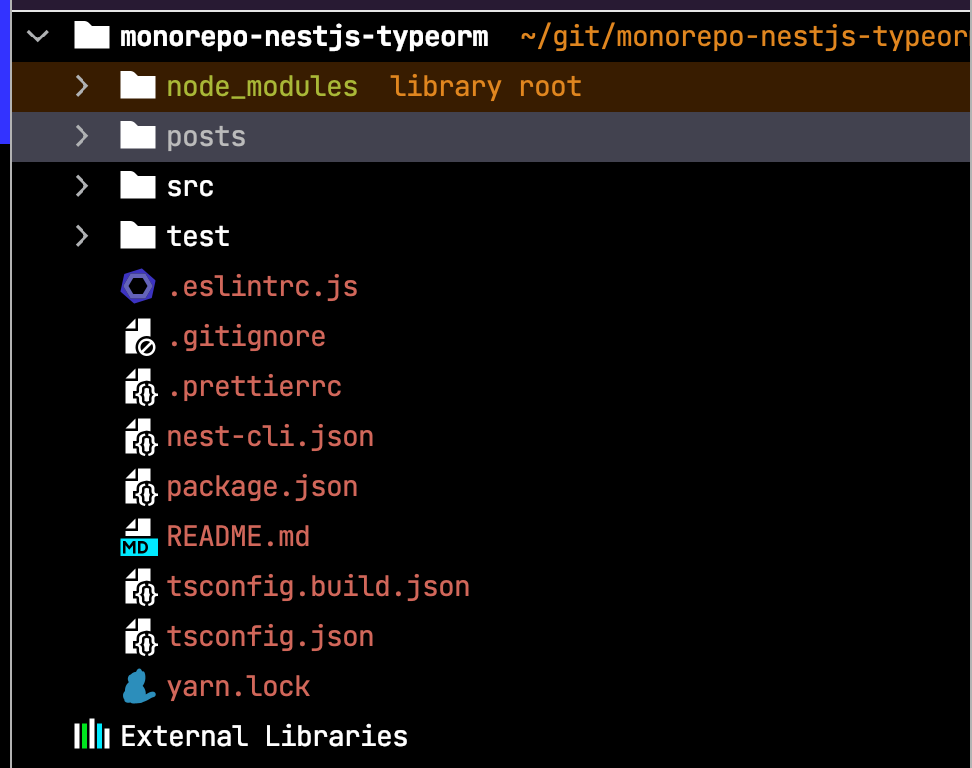

# 1. NestJS & TypeORM 환경에서 Monorepo 구성하기    

```bash
nest new monorepo-nestjs-typeorm
```




```bash
nest g app api
```

동일한 작업 공간 내에서 기존 애플리케이션과 함께 하위 애플리케이션을 스캐폴딩합니다 .  
이 두 응용 프로그램은 동일한 `node_modules`폴더( 단일 버전 정책 ) 및 구성 파일(예: tsconfig.json및 nest-cli.json)을 공유합니다. 
그러나 이러한 응용 프로그램은 별도로 실행, 개발 및 배포할 수 있습니다 .


```bash
nest g lib entity
```

## 시작

```bash
nest start api
```


```bash
nest start api --watch
```
