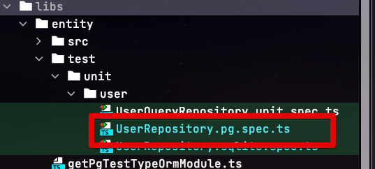

# 2. NestJS & TypeORM 환경에서 Monorepo 구성하기 - TypeORM 추가하기

[지난 시간](https://jojoldu.tistory.com/594) 에 이어, Monorepo로 구성된 프로젝트에 TypeORM을 추가해보겠습니다.  

## 1. 환경 설정

저 같은 경우 PostgreSQL을 사용할 예정이라 `pg` 를 기반으로 진행하겠습니다.  
  
필요한 패키지들을 먼저 추가합니다.

```bash
yarn add @nestjs/typeorm typeorm pg
```

그리고 TypeORM과 연동되어 로컬에서 실행할 PostgreSQL DB를 위해 `docker-compose.yml` 파일을 아래와 같이 생성합니다.

> 도커를 안쓰신다면 로컬에 본인이 원하는 DB를 설치하시면 됩니다.

```yaml
version: '3.8'

services:
  db:
    image: postgres
    ports:
      - "5432:5432"
    environment:
      - POSTGRES_DB=test
      - POSTGRES_USER=test
      - POSTGRES_PASSWORD=test
      - POSTGRES_INITDB_ARGS=--encoding=UTF-8
```

완성된 `docker-compose.yml` 를 기반으로 DB를 실행해둡니다.

```bash
docker-compose up
```

> 다음편에서, 도커나 별도의 로컬 DB 실행없이 메모리 DB로 빠르게 TypeORM 을 테스트 하는 방법을 소개드립니다.

## 2. libs에 Entity 추가

Entity는 이 프로젝트의 핵심 비지니스 로직을 가지고 있는 객체들이 모여있는 모듈입니다.  
그리고 이 핵심 객체들을 각 하위 모듈인 API / Admin이 사용하는 것이 현 프로젝트 구조인데요.


이에 맞게 `libs`에 `user` 디렉토리를 추가하겠습니다.


여러 Entity 클래스들을 만들 수 있겠지만,  
여기서는 간단하게 User Entity 만 기준으로 해서 진행하겠습니다.  
  
User Entity와 Repository 클래스를 **Data Mapper 패턴**으로 만들겠습니다.  


**libs/entity/src/user/User.entity**

```typescript
@Entity()
export class User {
  @PrimaryGeneratedColumn()
  id: number;

  @Column()
  firstName: string;

  @Column()
  lastName: string;

  @Column({ default: true })
  isActive: boolean;
}
```

**libs/entity/src/user/UserQueryRepository.entity**

```typescript
@EntityRepository(User)
export class UserQueryRepository extends Repository<User> {
    async findUserName(userId: number): Promise<UserName> {
        const queryBuilder = createQueryBuilder()
            .select(['user.firstName', 'user.lastName'])
            .from(User, 'user')
            .where(`user.id =:id`, { id: userId });

        const row = await queryBuilder.getOne();
        return plainToClass(UserName, row);
    }
}
```

**libs/entity/src/user/UserName**

```typescript
export class UserName {
  firstName: string;
  lastName: string;

  getFullName(): string {
    return `${this.firstName} ${this.lastName}`;
  }
}
```

**libs/entity/src/user/UserModule**

```typescript
@Module({
  imports: [TypeOrmModule.forFeature([User, UserQueryRepository])],
  exports: [TypeOrmModule],
  providers: [],
  controllers: [],
})
export class UserModule {}
```


이미 다들 아시겠지만, TypeORM에서는 2가지 패턴을 지원합니다.

* Active Record 패턴
* Data Mapper 패턴

초기의 **작은 App에서는** 어느 패턴이여도 상관없지만,  
유지보수와 확장성을 고려하면 Data Mapper를 선호하게 됩니다.  
  
Data Mapper 패턴이 Active Record 패턴에 비해 가장 큰 차이점은, **도메인을 Persistence 와 완전히 분리**한다는 것입니다.  
즉, Domain 객체와 Mapper를 분리해서 **데이터베이스를 Domain 객체에서 격리** 시킵니다.  
이는 Entity 클래스가 **데이터베이스에 대해 전혀 이해할 필요가 없음** (의존성이 없는) 을 의미하기 때문에 **Domain clean**을 할 수 있게 됩니다.  
이로인해 비지니스 로직이 매우 복잡한 경우 유지보수에 굉장히 큰 강점을 얻게 됩니다.   
  
반대로 Active Record 패턴의 경우 아무래도 하나의 클래스에서 여러 역할 (Command와 Query)을 하기 때문에 조금만 서비스 규모가 커지면 코드 복잡도가 굉장히 높아집니다.  
  
이외에도, 아래와 같은 **확장의 가능성**에 있어서도 장점을 얻습니다.

* TypeORM이 더이상 발전하지 못해, 다른 ORM을 사용해야할 경우
* 데이터 저장소가 RDBMS가 아니라 MongoDB, Redis, DynamoDB등으로 전환이 필요할 때
* 회원을 담당하는 로직 자체가 마이크로 서비스로 별도의 서비스로 분리되어 API 통신으로 진행해야할 경우

등등 다양한 상황에서 Active Record와 같이 특정 ORM, RDBMS에 종속적인 경우는 운영 & 확장에서 어려움을 겪습니다.  
  
일정 규모 이상의 서비스가 되면, 웹 서비스는 더이상 **데이터베이스와 특정 ORM에 종속적이지 않습니다**.  
그래서 저 같은 경우에는 Data Mapper 패턴을 상당히 선호하게 됩니다.  
  

## 테스트



```typescript
export function getPgTestTypeOrmModule() {
  return TypeOrmModule.forRoot({
    type: 'postgres',
    host: 'localhost',
    port: 5432,
    username: 'test',
    password: 'test',
    database: 'test',
    entities: [__dirname + '/../**/*.entity.ts'],
    synchronize: true,
    namingStrategy: new SnakeNamingStrategy(),
  });
}
```

```typescript
describe('UserCoreRepository', () => {
  let userRepository: Repository<User>;

  beforeAll(async () => {
    const module: TestingModule = await Test.createTestingModule({
      imports: [UserModule, getPgTestTypeOrmModule()],
    }).compile();

    userRepository = module.get('UserRepository');
  });

  beforeEach(async () => {
    await userRepository.clear();
  });

  it('Docker PostgreSQL save', async () => {
    const firstName = 'Lee';
    const lastName = 'Donguk';
    const user = new User();
    user.firstName = firstName;
    user.lastName = lastName;
    const savedUser = await userRepository.save(user);

    console.log(`result=${JSON.stringify(savedUser)}`);
    expect(savedUser.id).toBeGreaterThanOrEqual(1);
  });
});
```
