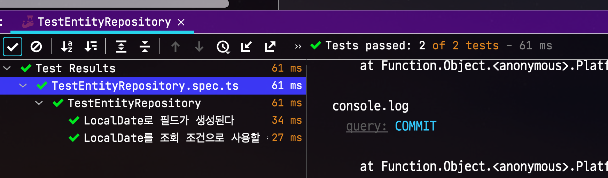
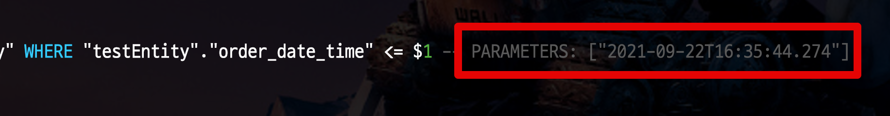

# js-joda 로 TypeORM Date 타입 대체하기 (with NestJS)

JavaScript 의 Date Type은 JavaScript의 단점을 이야기할때 항상 거론되는 점인데요.

* [javascript-date-type-is-horribly-broken](https://codeofmatt.com/javascript-date-type-is-horribly-broken/)

위 글에서 언급한 연산에 관한 문제도 있지만,  
단순히 +1 Day를 해야하는데도 아래와 같이 직관적이지 못한 잘못된 인터페이스의 코드를 사용해야하는 것도 문제인데요.  

```javascript
// Local time
var tomorrow = new Date();
tomorrow.setDate(tomorrow.getDate() + 1);

// UTC
var tomorrow = new Date();
tomorrow.setUTCDate(tomorrow.getUTCDate() + 1);
```

연산 코드 자체가 깔끔하지 못하기 때문에 TypeORM에서 날짜 Type을 다룰때도 결국 외부의 라이브러리에 의존하거나 불편한 방식의 연산을 할 수 밖에 없게 되는데요.  

```javascript

@Entity()
export class User extends BaseTimeEntity {
  ...

  @Column({
    type: 'timestamptz',
    nullable: true,
  })
  orderDateTime: Date;
  
  ...
    
  // 아래와 같이 + Day 코드가 필요함
  autoCancel(day: number): void {
    this.orderDateTime.setDate(this.orderDateTime.getDate() + 1);
  }
} 
```

더군다나 백엔드 애플리케이션에서 날짜(Date) 타입은 **불변 보장**이 필수적인데, Javascript의 Date는 불변이 아닙니다.  

* [why-you-should-never-mutate-a-javascript-date](https://unspecified.wordpress.com/2013/08/02/why-you-should-never-mutate-a-javascript-date/)
* [Java의 날짜와 시간 API](https://d2.naver.com/helloworld/645609)
    * Java를 기반으로 하고 있지만, 백엔드 애플리케이션에서 불변이 왜 필요한지 확실하게 소개하고 있으니 꼭 보시길 추천드립니다.

그래서 이런 점 때문에 Javascript의 대체제들이 굉장히 많이 나왔는데요.  


아무래도 백엔드에서는 번들링에 대한 걱정이 없기 때문에 아래와 같은 이유로 [js-joda](https://www.npmjs.com/package/js-joda) 를 개인적으로 추천합니다.

* 불변 보장
* 리치 인터페이스
* 변경 실패시 `Error` 보장
* 타임존 지원

간단하게 사용법을 보여드리자면 다음과 같습니다.

```typescript
import { LocalDate } from 'js-joda';

describe('js-joda', () => {
  it('js-joda', () => {
    const now = LocalDate.now();
    const after = now.plusDays(1);
    const before = now.minusDays(1);

    console.log(`now=${now}, after=${after}, before=${before}`);
    expect(now.isBefore(after)).toBeTruthy();
    expect(now.isEqual(after)).toBeFalsy();
    expect(now.isAfter(before)).toBeTruthy();
  });
});
```

굉장히 직관적인 인터페이스를 지원하고, 모든 연산은 불변객체를 기반으로 하기 때문에 처음 사용해도 쉽게 사용할 수 있습니다.  
 
이 `js-joda`를 TypeORM Entity의 기본 날짜 타입으로 사용하는 방법을 소개드리겠습니다.

## 1. ValueTransformer

TypeORM에는 `ValueTransformer` 라는 인터페이스를 지원합니다.  
해당 인터페이스는 데이터베이스와 ORM Entity 사이에서 데이터 변환을 담당합니다.
즉, 테이블과 클래스 사이의 타입 불일치 문제를 해결해줍니다.  
  
그래서 실제로 RDBMS의 `timestamp`, `Date`, `Datetime` 등을 Javascript의 Date가 아닌 `js-joda`의 `LocalDate`, `LocalDateTime` 으로 변환 받아 사용할 수 있게 됩니다.  
그럼 바로 한번 만들어보겠습니다.

### 1-1. LocalDateTimeTransformer, LocalDateTransformer

가장 먼저 js-joda 기반의 ValueTransformer 를 만들어보겠습니다.  
  
js-joda에서는 크게 2가지 타입이 있습니다.  

* `LocalDateTime`: 년,월,일,시,분,초가 포함된 일시 타입입니다.
* `LocalDate`: 년,월,일만 포함된 일자 타입입니다.

이 둘을 기반으로 각각의 ValueTransformer를 생성합니다.  
  
**LocalDateTimeTransformer**

```typescript
export class LocalDateTimeTransformer implements ValueTransformer {
  to(entityValue: LocalDateTime): Date {
    return DateTimeUtil.toDate(entityValue);
  }

  from(databaseValue: Date): LocalDateTime {
    return DateTimeUtil.toLocalDateTime(databaseValue);
  }
}
```

* `to(entityValue: LocalDateTime): Date`
  * Entity의 필드값이 DB에 적용될때 변환합니다.
  * 애플리케이션에서는 `LocalDateTime` 로 되어있는 값을, DB 연산 (조회조건, insert, update등 컬럼사용 등) 에서는 Date로 변환해서 사용되도록 합니다.
* `from(databaseValue: Date): LocalDateTime`
  * `to` 와는 반대로, DB의 컬럼값을 Entity로 변환할때 사용됩니다.
  * DB의 날짜 데이터를 Entity로 변환시에는 `LocalDateTime` 를 사용하도록 합니다.
    * 기본적으로 DB의 모든 날짜 데이터는 JavaScript의 `Date`로 변환을 합니다.
    * 그래서 `ValueTransformer` 는 JavaScript의 `Date` 를 변환합니다.

위와 같은 방식으로 `LocalDate`용 `ValueTransformer` 도 만들어줍니다.  
  
**LocalDateTransformer**

```typescript
export class LocalDateTransformer implements ValueTransformer {
  // entity -> db로 넣을때
  to(entityValue: LocalDate): Date {
    return DateTimeUtil.toDate(entityValue);
  }

  // db -> entity로 가져올때
  from(databaseValue: Date): LocalDate {
    return DateTimeUtil.toLocalDate(databaseValue);
  }
}
```

이렇게 만들어진 `Transformer` 를 Entity에 적용해보겠습니다.

### 1-2. Entity 적용

간단하게 테스트용 Entity를 만들어 봅니다.

```typescript
@Entity()
export class TestEntity extends BaseTimeEntity {
    @Column()
    name: string;

  // 1) LocalDateTransformer 적용
    @Column({
        type: 'timestamptz',
        transformer: new LocalDateTransformer(),
        nullable: true,
    })
    orderDate: LocalDate;

  // 2) LocalDateTimeTransformer 적용
    @Column({
        type: 'timestamptz',
        transformer: new LocalDateTimeTransformer(),
        nullable: true,
    })
    orderDateTime: LocalDateTime;

    constructor() {
        super();
    }

    static of(
        name: string,
        orderDate: LocalDate,
        orderDateTime: LocalDateTime,
    ): TestEntity {
        const testEntity = new TestEntity();
        testEntity.name = name;
        testEntity.orderDate = orderDate;
        testEntity.orderDateTime = orderDateTime;
        return testEntity;
    }
}
```

Entity에서 ValueTransformer를 적용하는것은 크게 어렵지 않습니다.

* `transformer: new LocalDateTransformer()`
* `transformer: new LocalDateTimeTransformer()`


## 2. 테스트 

이제 해당 기능이 정상적으로 작동하는지 검증해보겠습니다.  
  
### 조회 컬럼 검증

```typescript
  it('LocalDate로 필드가 생성된다', async () => {
    // given
    const now = LocalDate.now(); // yyyy-MM-dd
    const nowTime = LocalDateTime.now(); // yyyy-MM-dd HH:mm:ss

    // when
    await testEntityRepository.save(TestEntity.of('name', now, nowTime));
    const result = await testEntityRepository.find();
    const testEntity = result[0];

    // then
    expect(testEntity.id).toBeGreaterThanOrEqual(1);
    expect(testEntity.name).toBe('name');
    expect(testEntity.orderDate.isEqual(now)).toBeTruthy();
    expect(testEntity.orderDateTime.isEqual(nowTime)).toBeTruthy();
  });
```

### 조회 조건 컬럼 검증

```typescript
  it('LocalDate를 조회 조건으로 사용할 수 있다', async () => {
    // given
    const now = LocalDate.now(); // yyyy-MM-dd
    const nowTime = LocalDateTime.now(); // yyyy-MM-dd HH:mm:ss

    // when
    await testEntityRepository.save(TestEntity.of('name', now, nowTime));
    const testEntity = await testEntityRepository
      .createQueryBuilder('testEntity')
      .where('testEntity.orderDateTime <= :nowTime', { nowTime: nowTime })
      .getOne();

    // then
    expect(testEntity.id).toBeGreaterThanOrEqual(1);
    expect(testEntity.name).toBe('name');
    expect(testEntity.getCreatedAt().isAfter(nowTime)).toBeTruthy();
    expect(testEntity.orderDate.isEqual(now)).toBeTruthy();
    expect(testEntity.orderDateTime.isEqual(nowTime)).toBeTruthy();
  });
```

### 전체 테스트 코드

```typescript
describe('TestEntityRepository', () => {
  let testEntityRepository: Repository<TestEntity>;

  beforeAll(async () => {
    const module: TestingModule = await Test.createTestingModule({
      imports: [TestEntityModule, getPgTestTypeOrmModule()],
    }).compile();

    testEntityRepository = module.get('TestEntityRepository');
  });

  afterAll(async () => {
    await getConnection().close();
  });

  beforeEach(async () => {
    await testEntityRepository.clear();
  });

  it('LocalDate로 필드가 생성된다', async () => {
    // given
    const now = LocalDate.now(); // yyyy-MM-dd
    const nowTime = LocalDateTime.now(); // yyyy-MM-dd HH:mm:ss

    // when
    await testEntityRepository.save(TestEntity.of('name', now, nowTime));
    const result = await testEntityRepository.find();
    const testEntity = result[0];

    // then
    expect(testEntity.id).toBeGreaterThanOrEqual(1);
    expect(testEntity.name).toBe('name');
    expect(testEntity.getCreatedAt().isAfter(nowTime)).toBeTruthy();
    expect(testEntity.orderDate.isEqual(now)).toBeTruthy();
    expect(testEntity.orderDateTime.isEqual(nowTime)).toBeTruthy();
  });

  it('LocalDate를 조회 조건으로 사용할 수 있다', async () => {
    // given
    const now = LocalDate.now(); // yyyy-MM-dd
    const nowTime = LocalDateTime.now(); // yyyy-MM-dd HH:mm:ss

    // when
    await testEntityRepository.save(TestEntity.of('name', now, nowTime));
    const testEntity = await testEntityRepository
      .createQueryBuilder('testEntity')
      .where('testEntity.orderDateTime <= :nowTime', { nowTime: nowTime })
      .getOne();

    // then
    expect(testEntity.id).toBeGreaterThanOrEqual(1);
    expect(testEntity.name).toBe('name');
    expect(testEntity.getCreatedAt().isAfter(nowTime)).toBeTruthy();
    expect(testEntity.orderDate.isEqual(now)).toBeTruthy();
    expect(testEntity.orderDateTime.isEqual(nowTime)).toBeTruthy();
  });
});
```

둘 모두 테스트를 수행해보면 아래와 같이 정상적으로 수행되는 것을 볼 수 있습니다.



특히 두번째 테스트의 경우 **파라미터에서도 정상적으로 날짜 변환값이 사용된 것을 확인**할 수 있습니다. 



## 3. CreateDateColumn, UpdateDateColumn

TypeORM을 사용할때 거의 필수적으로 사용되는 날짜 대상이 바로 `@CreateDateColumn()`, `@UpdateDateColumn()` 데코레이터들인데요.  
  
아쉽게도, 현재 (**2021.09**) PostgreSQL 에서는 이 데코레이터들과 함께 Value Transformer를 사용할 수는 없습니다.

* [UpdateDateColumn fails with transformer](https://github.com/typeorm/typeorm/issues/7150)

현상은, ValueTransformer가 있을 경우 create 시간과 update 시간등이 transformer로 전달되지 않는 것인데요.  
  
그래서 이 부분에 한해서는 별도의 `getter` 메소드를 생성해서 처리합니다.

```typescript
import {
  CreateDateColumn,
  Generated,
  PrimaryColumn,
  UpdateDateColumn,
} from 'typeorm';
import { BigintTransformer } from '../transformer/BigintTransformer';
import { LocalDateTime } from 'js-joda';
import { DateTimeUtil } from '@app/entity/util/DateTimeUtil';

export abstract class BaseTimeEntity {
  @Generated('increment')
  @PrimaryColumn({ type: 'bigint', transformer: new BigintTransformer() })
  id: number;

  @CreateDateColumn({
    type: 'timestamptz',
    nullable: false,
  })
  createdAt: Date;

  @UpdateDateColumn({
    type: 'timestamptz',
    nullable: false,
  })
  updatedAt: Date;

  getCreatedAt(): LocalDateTime {
    return DateTimeUtil.toLocalDateTime(this.createdAt);
  }

  getUpdatedAtAt(): LocalDateTime {
    return DateTimeUtil.toLocalDateTime(this.updatedAt);
  }
}
```


* `setter` 가 필요하진 않습니다.
  * 이 데코레이터들의 값은 DB에 등록/수정/삭제가 일어날 경우에만 추가/변경이 일어나기 때문입니다.
* 조회조건에서 사용하기 위해서는 어쩔수 없이 별도의 유틸리티 함수를 통해서 연산을 해야만 합니다.

테스트 코드로 검증하면 `getter` 메소드 자체는 잘 작동합니다.

```typescript
  it('LocalDate로 필드가 생성된다', async () => {
      ...
      // getCreatedAt() 도 검증한다.
      expect(testEntity.getCreatedAt().isAfter(nowTime)).toBeTruthy();
      expect(testEntity.orderDate.isEqual(now)).toBeTruthy();
      expect(testEntity.orderDateTime.isEqual(nowTime)).toBeTruthy();
  });
```

다만, 조회조건으로는 바로 사용하지 못한다는 단점이 있어서, 이 점 때문에라도 이슈가 최대한 빨리 해결되길 기다리고 있습니다.

## 4. createQueryBuilder Not Working

직관적인 쿼리를 만들 수 있는 `createQueryBuilder` 를 쓸 경우에 이 `ValueTransformer` 가 작동하지 않습니다.  

* [no respect to value transformer defined on the fields](https://github.com/typeorm/typeorm/issues/1990)

그래서 `createQueryBuilder` 를 쓸 경우에는 `Date` 로 변환 후 `where` 에 적용하시거나, `find` 를 통한 조회 조건으로 변경이 필요합니다.
