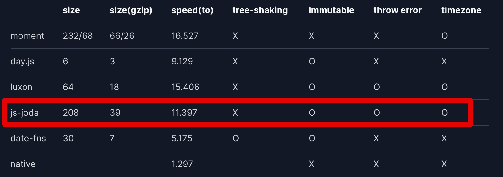

# js-joda 로 TypeORM Date 타입 대체하기 (with NestJS)

Javascript 의 Date Type은 Javascript의 단점을 이야기할때 항상 거론되는 점인데요.

* [javascript-date-type-is-horribly-broken](https://codeofmatt.com/javascript-date-type-is-horribly-broken/)

위 글에서 언급한 연산에 관한 문제도 있지만,  
단순히 +1 Day를 해야하는데도 아래와 같이 직관적이지 못한 잘못된 인터페이스의 코드를 사용해야하는 것도 문제인데요.  

```javascript
// Local time
var tomorrow = new Date();
tomorrow.setDate(tomorrow.getDate() + 1);

// UTC
var tomorrow = new Date();
tomorrow.setUTCDate(tomorrow.getUTCDate() + 1);
```

더군다나 백엔드 애플리케이션에서 날짜(Date) 타입은 **불변 보장**이 필수적인데, Javascript의 Date는 불변이 아닙니다.  

* [why-you-should-never-mutate-a-javascript-date](https://unspecified.wordpress.com/2013/08/02/why-you-should-never-mutate-a-javascript-date/)
* [Java의 날짜와 시간 API](https://d2.naver.com/helloworld/645609)
    * Java를 기반으로 하고 있지만, 백엔드 애플리케이션에서 불변이 왜 필요한지 확실하게 소개하고 있으니 꼭 보시길 추천드립니다.

그래서 이런 점 때문에 Javascript의 대체제들이 굉장히 많이 나왔는데요.  



아무래도 백엔드에서는 번들링에 대한 걱정이 없기 때문에

* 불변 보장
* 리치 인터페이스
* 변경 실패시 `Error` 보장
* 타임존 지원

으로 [js-joda](https://www.npmjs.com/package/js-joda) 를 개인적으로 추천합니다.
  
간단하게 사용법을 보여드리자면 다음과 같습니다.

```typescript
import { LocalDate } from 'js-joda';

describe('js-joda', () => {
  it('js-joda', () => {
    const now = LocalDate.now();
    const after = now.plusDays(1);
    const before = now.minusDays(1);

    console.log(`now=${now}, after=${after}, before=${before}`);
    expect(now.isBefore(after)).toBeTruthy();
    expect(now.isEqual(after)).toBeFalsy();
    expect(now.isAfter(before)).toBeTruthy();
  });
});
```

굉장히 직관적인 인터페이스를 지원하기 때문에 처음 사용해도 바로 적응해서 사용할 수 있습니다.  
  
이번 시간에는 이 `js-joda`를 TypeORM Entity의 기본 날짜 타입으로 사용하는 방법을 소개드리겠습니다.

## 1. TypeORM의 ValueTransformer

데이터베이스에 읽거나 쓸 때 이 열을 마샬링(unshaling)하는 데 사용할 값 변환기(또는 값 변환기 배열)를 지정합니다.  
배열의 경우 값 변환기는 entityValue에서 databaseValue로, 그리고 databaseValue에서 entityValue로 역순으로 적용됩니다.

```typescript
export class LocalDateTimeTransformer implements ValueTransformer {
  to(entityValue: LocalDateTime): Date {
    return DateTimeUtil.toDate(entityValue);
  }

  from(databaseValue: Date): LocalDateTime {
    return DateTimeUtil.toLocalDateTime(databaseValue);
  }
}
```

```typescript
export class LocalDateTransformer implements ValueTransformer {
  // entity -> db로 넣을때
  to(entityValue: LocalDate): Date {
    return DateTimeUtil.toDate(entityValue);
  }

  // db -> entity로 가져올때
  from(databaseValue: Date): LocalDate {
    return DateTimeUtil.toLocalDate(databaseValue);
  }
}
```

### Entity 적용

```typescript
@Entity()
export class TestEntity extends BaseTimeEntity {
    @Column()
    name: string;

    @Column({
        type: 'timestamptz',
        transformer: new LocalDateTransformer(),
        nullable: true,
    })
    orderDate: LocalDate;

    @Column({
        type: 'timestamptz',
        transformer: new LocalDateTimeTransformer(),
        nullable: true,
    })
    orderDateTime: LocalDateTime;

    constructor() {
        super();
    }

    static of(
        name: string,
        orderDate: LocalDate,
        orderDateTime: LocalDateTime,
    ): TestEntity {
        const testEntity = new TestEntity();
        testEntity.name = name;
        testEntity.orderDate = orderDate;
        testEntity.orderDateTime = orderDateTime;
        return testEntity;
    }
}
```

## CreateDateColumn, UpdateDateColumn

```typescript
import {
  CreateDateColumn,
  Generated,
  PrimaryColumn,
  UpdateDateColumn,
} from 'typeorm';
import { BigintTransformer } from '../transformer/BigintTransformer';
import { LocalDateTime } from 'js-joda';
import { DateTimeUtil } from '@app/entity/util/DateTimeUtil';

export abstract class BaseTimeEntity {
  @Generated('increment')
  @PrimaryColumn({ type: 'bigint', transformer: new BigintTransformer() })
  id: number;

  @CreateDateColumn({
    type: 'timestamptz',
    nullable: false,
  })
  createdAt: Date;

  @UpdateDateColumn({
    type: 'timestamptz',
    nullable: false,
  })
  updatedAt: Date;

  getCreatedAt(): LocalDateTime {
    return DateTimeUtil.toLocalDateTime(this.createdAt);
  }

  getUpdatedAtAt(): LocalDateTime {
    return DateTimeUtil.toLocalDateTime(this.updatedAt);
  }
}
```

* [CreateDateColumn with ValueTransformer](https://github.com/typeorm/typeorm/issues/7407)


```typescript
describe('TestEntityRepository', () => {
    let testEntityRepository: Repository<TestEntity>;

    beforeAll(async () => {
        const module: TestingModule = await Test.createTestingModule({
            imports: [TestEntityModule, getPgTestTypeOrmModule()],
        }).compile();

        testEntityRepository = module.get('TestEntityRepository');
        await testEntityRepository.clear();
    });

    afterEach(async () => {
        await getConnection().close();
    });

    it('LocalDate로 필드가 생성된다', async () => {
        // given
        const now = LocalDate.now(); // yyyy-MM-dd
        const nowTime = LocalDateTime.now(); // yyyy-MM-dd HH:mm:ss

        // when
        await testEntityRepository.save(TestEntity.of('name', now, nowTime));
        const result = await testEntityRepository.find();
        const testEntity = result[0];

        // then
        expect(testEntity.id).toBeGreaterThanOrEqual(1);
        expect(testEntity.name).toBe('name');
        expect(testEntity.getCreatedAt().isAfter(nowTime)).toBeTruthy();
        expect(testEntity.orderDate.isEqual(now)).toBeTruthy();
        expect(testEntity.orderDateTime.isEqual(nowTime)).toBeTruthy();
    });
});
```


