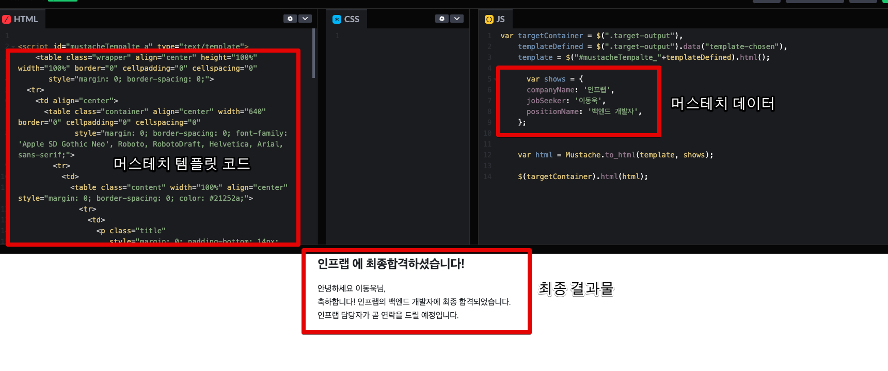

# Mustache.js 로 이메일 템플릿 구성하기

이메일 기능 구현을 위해서 많은 고민을 하는 부분이 이메일 본문을 위한 템플릿 구성입니다.

> AWS SES 등 이메일 발송 자체는 이제 예전처럼 SMTP 서버 구축 등을 할 필요가 없어서 훨씬 난이도가 줄었습니다.

일반적으로 이메일의 본문은 HTML + Inner CSS로된 마크업코드를 작성합니다.  
이메일 안에서는 CSS나 JS 파일 로드가 안되기 때문에 HTML 코드만으로 해결이 되어야 하는데요.
위에서 언급한 HTML 코드를 **단순 문자열로만** 진행할 경우 다음의 문제점들이 있습니다.

* html 코드에서 오타가 발생하는걸 찾을수가 없다.
  * html 코드가 결국 문자열이기 때문에 `</div>` 태그가 1개 부족해도, 혹은 `attribute` 가 오타가 나도 IDE에선 전혀 감지할수가 없다.

* 렌더링 해야할 코드가 늘어나면 늘어날수록 수정 난이도가 급상승한다.
  * 홀따옴표('), 쌍따옴표(") 만 가지고 표현할수가 없어 `\` 를 붙이기 시작하면 이게 어떤 dom 형태가 될지 감이 안잡혀서 수정시간이 굉장히 길어진다.


(단순 문자열로만 하는 경우엔 이것보다 심한 코드도 종종 보게 됩니다.)  


그러다보니 이메일 본문을 작성하기 위해서는 다음의 조건들이 만족 되어야 편하게 개발이 가능합니다.

* HTML 코드로 작성하되 서버 애플리케이션 코드에서 문자열 (`string`) 으로 변환이 가능해야한다
* HTML 코드 내부에 수신자의 이름, 주문내역 등과 같이 변수들을 할당해서 치환이 가능해야 한다
* HTML과 Inner CSS의 코드 하이라이팅 / 자동완성 등이 지원 되어야한다


위 내용을 보면 예전 [EJS](https://ejs.co/) 와 같은 서버 템플릿 엔진이 떠오를텐데요.  
결국 **서버에서 데이터와 마크업 코드를 합쳐서 HTML로 내려준다**와 비슷하기 때문입니다.  


최종적으로 내려주는 **결과물이 HTML 이냐 문자열이냐**의 차이일뿐이죠.  

그래서 [EJS](https://ejs.co/) 와 같은 템플릿엔진 중에 한가지를 선택해서 이를 이용해 **템플릿파일과 데이터를 이용해 string으로 된 HTML 폼을 만든다** 가 되어야 합니다.  

여기서 어떤 템플릿 엔진을 쓸까는 본인의 취향인데, 저 같은 경우엔 **로직을 넣을 수 없는** [Mustache (머스테치)](https://github.com/janl/mustache.js/)를 선호합니다.


로직을 넣을 수 없다는 것은 **템플릿 파일에 매크로와 같은 별도 함수를 추가로 넣을 수 없음**을 의미합니다.  

> 물론 머스테치의 헬퍼가 포함된 버전인 [handlebars](https://handlebarsjs.com/)를 사용한다면 가능은 합니다.

이메일 템플릿은 View 템플릿이 아니기 때문에 별도의 매크로나 헬퍼가 필요하지 않고, **가장 경량화된 형태**로 하는 것이 좋기 때문입니다.

## 1. 소개 및 설치

Mustache.js의 사용법은 간단합니다.  
다음과 같이 `render` 함수에 `HTML` 코드와 `Data` 를 인자로 넣어서 실행하면 **데이터와 마크업이 합쳐진 결과물이 내려집니다**

```js
var Mustache = require('mustache');

var view = {
  title: "Joe",
  calc: function () {
    return 2 + 4;
  }
};

var output = Mustache.render("{{title}} spends {{calc}}", view);
```

여기서 템플릿의 경우 아래의 `<script id="template" type="x-tmpl-mustache">` 와 같이 지정해서

```js
<html>
  <body onload="renderHello()">
    <div id="target">Loading...</div>
    <script id="template" type="x-tmpl-mustache">
      Hello {{ name }}!
    </script>

    <script src="https://unpkg.com/mustache@latest"></script>
    <script src="render.js"></script>
  </body>
</html>
```

아래의 함수처럼 해당 템플릿을 직접 가져와서 렌더링할 수도 있습니다.
```js
function renderHello() {
  var template = document.getElementById('template').innerHTML;
  var rendered = Mustache.render(template, { name: 'Luke' });
  document.getElementById('target').innerHTML = rendered;
}
```

하지만 저희는 이렇게 불필요한 HTML을 사용하진 않고 Mustache 파일로 직접 마크업을 작성할 예정입니다.  
(실제 Dom Select를 서버에서 할 수도 없기도 하고요 ^^;)  

Mustache.js는 이미 타입스크립트를 지원하기 때문에 다음과 같이 설치가 가능합니다.

```bash
yarn add mustache @types/mustache
```

설치가 끝나셨으면, 본격 이메일 템플릿 코드를 작성해보겠습니다.

## 2. 이메일 템플릿 코드 작성

먼저 샘플로 사용할 Mustache 파일을 만들어봅니다.

**sample.hbs**

```html
<table class="wrapper" align="center" height="100%" width="100%" border="0" cellpadding="0" cellspacing="0"
       style="margin: 0; border-spacing: 0;">
  <tr>
    <td align="center">
      <table class="container" align="center" width="640" border="0" cellpadding="0" cellspacing="0"
             style="margin: 0; border-spacing: 0; font-family: 'Apple SD Gothic Neo', Roboto, RobotoDraft, Helvetica, Arial, sans-serif;">
        <tr>
          <td>
            <table class="content" width="100%" align="center" style="margin: 0; border-spacing: 0; color: #21252a;">
              <tr>
                <td>
                  <p class="title"
                     style="margin: 0; padding-bottom: 14px; font-size: 24px; line-height: 39px; letter-spacing: -0.3px; font-weight: bold;">{{companyName}}
                    에 최종합격하셨습니다!</p>
                </td>
              </tr>
              <tr>
                <td class="content__description"
                    style="text-align: left; font-size: 16px; line-height: 26px; color: #21252a;">
                  안녕하세요 {{jobSeeker}}님,<br>
                  축하합니다! {{companyName}}의 {{positionName}}에 최종 합격되었습니다.<br>
                  {{companyName}} 담당자가 곧 연락을 드릴 예정입니다.<br>
                </td>
              </tr>
            </table>
          </td>
        </tr>
      </table>
    </td>
  </tr>
</table>
```

IDE에서는 Mustache/handlebars 파일을 아래 2개의 확장자로 구분하는데요.

* Mustache: `.mustache`
* Handlebars: `.hbs`

머스테치라고 해서 `.mustache` 를 써야하는 것이 아니고, `.hbs` 를 사용해도 IDE의 지원을 동일하게 받기 때문에 좀 더 짧게 쓸 수 있는 `.hbs` 를 파일 확장자로 사용하겠습니다.

> Mustache/handlebars 가 사실상 동일한 템플릿 엔진입니다.


위 마크업 코드를 보시면 마크업이 아닌 문법이 보이실텐데요.

* `{{jobSeeker}}`, `{{companyName}}` 등과 같이 `{{}}` 가 머스테치에서 데이터를 사용하는 문법입니다.
* `{{}}` 에 지정된 이름은 `Mustache.render(template, data)` 에서 `data`에 있는 속성 (property) 와 일치하는 데이터를 사용합니다.
* 그 외 반복문/조건문 등 좀 더 다양한 문법에 대해서는 [김태곤님의 글](https://taegon.kim/archives/4910)을 참고해보시면 좋습니다.

위 `sample.hbs` 에 있는 `{{}}` 변수들에 데이터를 넣어서 최종적으로 HTML 문자열로 만들어주는 템플릿 함수를 만들어보겠습니다.  

**HtmlTemplate.ts**

```js
import { Injectable } from '@nestjs/common';
import * as mustache from 'mustache';
import * as path from 'path';
import * as fs from 'fs/promises';

@Injectable()
export class HtmlTemplate {
  async templateFromFile(filePath: string, data: any): Promise<string> {
    const html = await fs.readFile(
      path.join(__dirname, `../public/${filePath}.hbs`), // (1)
    );
    return this.template(html.toString(), data);
  }

  template(html: string, data: any): string {
    return mustache.render(html, data);
  }
}
```

(1) ```path.join(__dirname, `../public/${filePath}.hbs`)```

* 머스테치 파일들을 `public` 디렉토리에 모아두고 사용할 예정이라 파일 위치에 항상 `public` 을 둡니다
* 입력 받은 파일명에 확장자 `.hbs`를 추가해서 `templateFromFile` 에는 항상 **파일명**만 넣을수 있도록 편의를 제공합니다.

이렇게 해서 최종적으로 디렉토리 구조는 다음과 같이 됩니다.


> 저는 `HtmlTemplate` 를 **DI 받아서** 사용하기 위해서 별도의 Module (`HtmlTemplateModule`) 을 만들었습니다.  


## 3. 테스트

작성된 `HtmlTemplate` 를 한번 테스트 해보겠습니다.

**HtmlTemplate.spec.ts**  

첫번째 테스트에서는 `template` 메소드를 검증합니다.  
**파일을 잘 읽어왔다는 가정하에** 읽어온 파일의 HTML 코드와 데이터가 잘 합쳐져 마크업 문자열로 변환되는지 검증합니다.

```js
describe('HtmlTemplate', () => {
  let sut: HtmlTemplate;

  beforeEach(() => {
    sut = new HtmlTemplate();
  });

  it('template 호출시 html과 데이터가 합쳐서 문자열 반환된다', () => {
    const data = {
      companyName: '인프랩',
      companyUser: '이동욱',
    };
    const html = '<p>{{companyName}} 소속의 {{companyUser}}님 안녕하세요</p>';

    const result = sut.template(html, data);

    expect(result).toBe('<p>인프랩 소속의 이동욱님 안녕하세요</p>');
  });

});
```

두번째 테스트에서는 **파일까지 잘 읽어오는지** 검증합니다.

```js

  it('hbs 파일과 데이터가 합쳐서 문자열 반환된다', async () => {
    const data = {
      companyName: '인프랩',
      jobSeeker: '이동욱',
      positionName: '백엔드 개발자',
    };
    const fileName = 'sample';

    const result = await sut.templateFromFile(fileName, data);

    expect(result).toContain('안녕하세요 이동욱님');
    expect(result).toContain(
      '축하합니다! 인프랩의 백엔드 개발자에 최종 합격되었습니다',
    );
    expect(result).toContain('인프랩 담당자가 곧 연락을 드릴 예정입니다');
  });
```

둘 모두 실행해보면?


테스트가 정상적으로 통과되는 것을 볼 수 있습니다.

## 4. Tips

머스테치를 좀 더 잘 사용하기 위해서는 다음의 팁이 도움을 줄 수 있습니다.

### IDE Plugin

먼저 IntelliJ / WebStorm 등과 같은 IDE에서는 **유/무료와 관계없이** 머스테치/핸들바의 **코드하이라이팅 / 자동완성 / Hint**을 지원받을 수 있습니다.  
아래 플러그인을 설치하시면 되는데요.

* [플러그인](https://plugins.jetbrains.com/plugin/6884-handlebars-mustache)

설치하시면 다음과 같이 `.hbs`, `.mustache` 에서는 HTML과 동일한 코드 지원을 받을 수 있습니다.


### Preview

작성된 머스테치 파일에 대해서 HTML 렌더링 결과를 미리 볼 수 없을까 하는 고민이 있습니다.  
이럴때는 **머스테치 Codepen**를 통해서 볼 수 있습니다.

* [머스테치 Codepen](https://codepen.io/adrianroworth/pen/RgxmYM)

들어가보시면 다음과 같이 머스테치 마크업 코드와 데이터 코드를 넣을 수 있는 화면이 나옵니다.  
양식에 맞게 채워주시면 아래와 같이 결과물을 미리 볼 수 있습니다.


