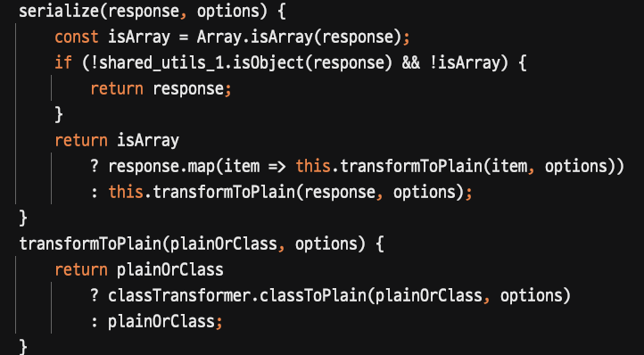
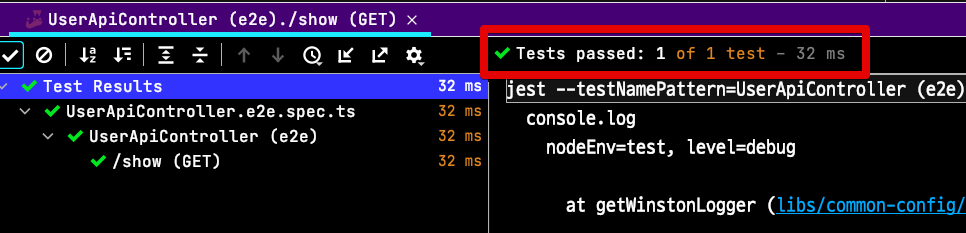
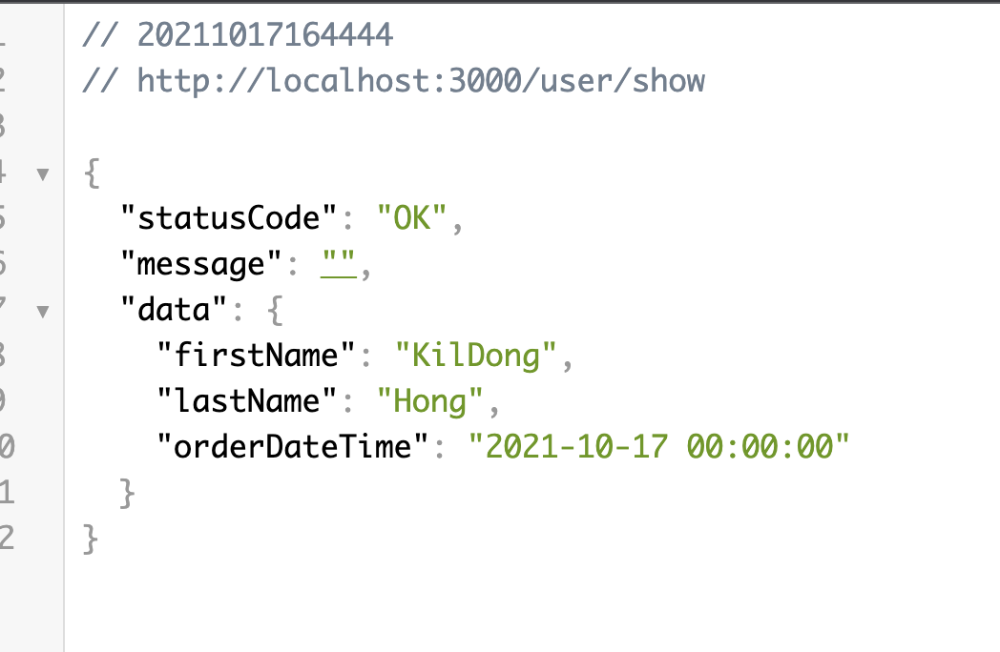

# NestJS에서 응답/요청 객체 직렬화 (Serialization) 하기

저 같은 경우에 최대한 Dto를 불변으로 만들기 위해 setter나 public 필드는 배제하는데요.  
어쩔수 없이 public 필드 (혹은 public setter)를 써야하는 경우 (TypeORM의 Entity 등)를 제외하고는 무조건이다 싶을 정도로 **딱 필요한 정도로만 외부 제공용 메소드**를 만들어서 사용합니다.  

이를 위해서는 Controller에서 사용하는 응답/요청 Dto 객체의 직렬화는 필수로 진행하게 됩니다.  

이번 시간에는 이런 상황등을 대비해서 응답/요청 객체의 직렬화 하는 방법을 진행해보겠습니다.


## 1. 응답 객체 직렬화하기

흔히 소프트웨어 설계에서 이야기하는 응집도(cohesion)와 결합도(coupling)가 있습니다.  
좋은 코드 디자인이라 하면, **높은 응집도 / 낮은 결합도**로 설계해야 하는데요.  

한 객체가 변경이 발생하면 해당 객체에 의존하는 다른 객체들도 변경해야 하기 때문에 이들의 변경 범위를 최소화 하기 위해 캡슐화를 사용합니다.  
이를 위해 일반적으로 **모든 내부 필드는 private으로 직접 접근을 차단**하고, **외부에서의 접근은 지정된 메소드를 통해서만** 진행하도록 하는데요.  

* 이와 관련해서 [이전 글-객체지향 (Object Oriented) 디자인 (Design)](https://jojoldu.tistory.com/592)을 참고해보시면 좋습니다.

### 1-1. class-transformer 의존성 등록

JSON 직렬화를 위해서는 직렬화 라이브러리가 필요한데요.  
NestJS에서는 공식적으로 [class-transformer](https://github.com/typestack/class-transformer)를 사용하고 있습니다.  

데코레이터 기반의 직렬화/역직렬화 라이브러리인데요.  
최근 나오는 많은 MVC 프레임워크들이 이 [class-transformer](https://github.com/typestack/class-transformer) 를 사용하고 있습니다.  

본인의 NestJS package.json에 `class-transformer` 와 `reflect-metadata` 가 포함되어있는지 확인 하시고, 포함안되어있다면 두 패키지를 모두 설치해주세요.

```bash
yarn add reflect-metadata class-transformer
```

* `reflect-metadata` 는 리플렉션을 지원하는 라이브러리이며, 코드의 메타 정보 (메소드/필드/변수 등)에 접근하기 위한 기술입니다.
* 대부분의 데코레이터들은 리플렉션 개념을 통해 필요한 속성을 추가하거나 제거하는 등의 행동을 할 수 있습니다.
* Java 나 C# 에서 이미 유명한 개념이라 관련해서 꼭 NodeJS로 키워드를 검색하기 보다는 Java나 C#의 컨텐츠를 함께 보시는 것을 추천드립니다.

### 1-2. 글로벌 인터셉터 등록

필요한 패키지들 (`class-transformer`, `reflect-metadata`)이 모두 설치되셨다면, 이제 **모든 HTTP 요청에서 직렬화가 가능하도록** 직렬화 인터셉터를 글로벌로 추가합니다.

```typescript
app.useGlobalInterceptors(new ClassSerializerInterceptor(app.get(Reflector)));
```

작동 방식은 간단합니다.

* `ClassSerializerInterceptor` 클래스에서 HTTP 응답값을 중간에서 가로채 (Interceptor) `class-transformer` 의 `classToPlain()` 함수를 호출하여 JSON 직렬화를 해서 반환합니다.




저 같은 경우엔 이런 **글로벌 설정을 별도의 함수로** 만들어서 사용하는데요.

* 모노레포를 주로 쓰기 때문에 여러 `apps` 모듈에서 공통적으로 사용하기 위함
* E2E (End To End) 테스트에서도 실 서비스와 동일한 인터셉터 설정을 위해 공통적으로 사용하기 위함

과 같은 이유 때문입니다.  

그래서 아래와 같이 글로벌 인터셉터들의 설정을 모아두는 함수를 하나 만들어둡니다.

```typescript
export function setNestApp<T extends INestApplication>(app: T): void {
  app.useGlobalInterceptors(new ClassSerializerInterceptor(app.get(Reflector)));
  ...
}
```

그리고 이 함수를 `main.ts` 와 각 E2E 테스트에서 호출합니다.  

**main.ts**

```typescript
async function bootstrap() {
  const app = await NestFactory.create(ApiAppModule);
  ...

  setNestApp(app);

  ...
  await app.listen(3000);
}
bootstrap();
```

**xxx.e2e.ts**

```typescript
describe('UserApiController (e2e)', () => {
  let app: INestApplication;
  let userRepository: Repository<User>;

  beforeAll(async () => {
    const module: TestingModule = await Test.createTestingModule({
      imports: [ApiAppModule],
    }).compile();

    app = module.createNestApplication();
    userRepository = module.get(getRepositoryToken(User));

    setNestApp(app); // ClassSerializerInterceptor 적용
    await app.init();
  });
```

모든 설정이 끝났다면 , 이제 테스트를 한번 해보겠습니다.

### 1-3. 테스트용 Dto 생성

API 응답용 Dto를 다음과 같이 작성합니다.

```typescript
export class UserShowDto {
  // (1)
  @Exclude() private readonly _id: number;
  @Exclude() private readonly _firstName: string;
  @Exclude() private readonly _lastName: string;
  @Exclude() private readonly _orderDateTime: LocalDateTime;

  constructor(user: User) {
    this._id = user.id;
    this._firstName = user.firstName;
    this._lastName = user.lastName;
    this._orderDateTime = user.orderDateTime.plusDays(1); // (2)
  }

  @ApiProperty()
  @Expose() // (3)
  get id(): number {
    return this._id;
  }

  @ApiProperty()
  @Expose()
  get firstName(): string {
    return this._firstName;
  }

  @ApiProperty()
  @Expose()
  get lastName(): string {
    return this._lastName;
  }

  @ApiProperty()
  @Expose()
  get orderDateTime(): string {
    return DateTimeUtil.toString(this._orderDateTime); // (4)
  }
}
```

> 여기서 사용하는 날짜 타입 라이브러리는 [js-joda](https://js-joda.github.io/js-joda/) 입니다.

(1) `Exclude()`

* 내부 멤버 변수인 `_id` 등을 JSON 직렬화 대상에서 제외합니다.
* class-transformer의 경우 `private` 변수라도 직렬화를 시킬 수 있기 때문에 **노출을 원하지 않는 곳**들은 모두 Exclude() 처리하는 것이 좋습니다

(2) `user.orderDateTime.plusDays(1);`

* Dto 내부에서 쉽게 연산이 가능하도록 **노출용 타입이 아닌**, 원래 타입 그대로를 저장하고 재사용합니다.
* 날짜값의 경우 JSON으로 안전하게 직렬화 하기 위해서는 문자열을 사용하게 되는데, 생성자로 받자마자 바로 문자열로 변환할 경우, 반환하기전 추가 연산이 필요한 경우 다시 날짜타입(`LocalDateTime`)으로 변환해야하는 과정이 필요합니다.
* 그 외 다양한 요소에서 **원본 타입과 노출용 타입은 분리**하는 것이 장점이 많습니다.

(3) `@Expose()`

* `class-transformer` 의 데코레이터로, 직렬화 대상 필드를 지정합니다.
* 여기서는 모든 멤버변수는 `@Exclude()` 로 직렬화 대상에서 제외하고, 온전히 노출에만 사용할 수 있는 getter 메소드에만 `@Expose()` 를 선언합니다.

(4) `DateTimeUtil.toString(this._orderDateTime);`

* API 로 약속된 포맷으로 날짜값을 보내기 위한 전환 작업을 합니다.

해당 데코레이터들이 실제 API 응답에서도 잘 되는지 한번 검증해봅니다.

### 1-4. 테스트

먼저 테스트 코드로 기능을 검증해봅니다.

```typescript
it('/show (GET)', async () => {
  const res = await request(app.getHttpServer()).get('/user/show');

  expect(res.status).toBe(200);
  const data = res.body.data;
  expect(data.firstName).toBe('KilDong');
  expect(data.lastName).toBe('Hong');
  expect(data.orderDateTime).toBe('2021-10-17 00:00:00');

  // private field assert
  expect(data._firstName).toBeUndefined();
  expect(data._lastName).toBeUndefined();
  expect(data._orderDateTime).toBeUndefined();
});
```

> 모든 코드는 [Github](https://github.com/jojoldu/monorepo-nestjs-typeorm/tree/master/apps/api)에 있습니다.

테스트 코드로는 2가지를 검증했습니다.

* `getter` 메소드가 정상적으로 JSON 변환이 되었는지
* `private` 멤버 변수가 JSON에서 정상적으로 제외되었는지

테스트를 수행해보면?



정상적으로 기능이 작동한 것을 알 수 있습니다.  
  
테스트 코드를 작성했지만, 그래도 의심이 된다면 브라우저에서도 API를 호출해서 한번 확인해봅니다.



응답용 JSON 직렬화가 잘 작동된 것을 확인하였습니다.

## 2. 요청 객체 역직렬화하기

> HTTP 요청시 인터셉터와 파이프의 호출 순서는 인터셉터 -> 파이프가 됩니다.

요청 객체의 경우엔 JSON -> 클래스 인스턴스로 변환하는 역직렬화가 필요합니다.  
이 부분은 `class-transformer` 외에 `class-validator` 가 추가로 필요합니다.  
  
만약 본인 프로젝트에 [class-validator](https://github.com/typestack/class-validator) 가 아직 없다면 설치를 해줍니다.

```bash
yarn add class-validator
```

### 2-1. 글로벌 파이프로 요청 객체 역직렬화 등록

[class-validator](https://github.com/typestack/class-validator) 는 class-transformer와 비슷하게 데코레이터 기반의 클래스 벨리데이션 라이브러리입니다.  
  
NestJS 에서는 `class-validator` 의 **데코레이터를 기반으로 Dto들의 검증을 권장**하는데요.  
이를 위해서는 `ValidationPipe` 를 사용하면 되는데, `ValidationPipe` 에서는 추가 옵션으로 **요청 객체를 역직렬화**할 수 있습니다.

```typescript
export function setNestApp<T extends INestApplication>(app: T): void {
  ...
  app.useGlobalPipes(new ValidationPipe({ transform: true }));
  ...
}
```

> 이런 파이프 역시 앞에서 만들어둔 `setNestApp` 함수에 추가해서 여러 apps / 여러 E2E 테스트에서 동일하게 적용할 수 있도록 합니다.

* `ValidationPipe` 는 `class-validator` 의 데코레이터 기반으로 벨리데이션을 지원하는 파이프입니다.
* 해당 파이프에 추가 옵션으로 `{ transform: true }` 을 넣게 되면, 벨리데이션이 끝난 요청 객체를 실제 클래스의 인스턴스로 변환되어 Controller에서 받을 수 있게 됩니다.

그래서 원래는 다음과 같은 코드를

```typescript
@Post('/signup')
async signup(@Body() dto: UserSignupReq): Promise<ResponseEntity<string>> {
  try {
    const req = plainToClass(UserSignupReq, dto); // json -> 인스턴스
    await this.userApiService.signup(dto.toEntity()); 
    return ResponseEntity.OK();
  } catch (e) {
    this.logger.error(`dto = ${JSON.stringify(dto)}`, e);
    return ResponseEntity.ERROR_WITH('회원 가입에 실패하였습니다.');
  }
}
```

아래와 같이 `plainToClass` 없이 곧바로 인스턴스를 사용할 수 있습니다.

```typescript
@Post('/signup')
async signup(@Body() dto: UserSignupReq): Promise<ResponseEntity<string>> {
  try {
    await this.userApiService.signup(dto.toEntity()); // JSON이 아닌 UserSignupReq 클래스의 인스턴스라서 바로 멤버 메소드를 사용할 수 있다
    return ResponseEntity.OK();
  } catch (e) {
    this.logger.error(`dto = ${JSON.stringify(dto)}`, e);
    return ResponseEntity.ERROR_WITH('회원 가입에 실패하였습니다.');
  }
}
```

이렇게 파이프를 등록하면 이후부터는 매번 `plainToClass`를 할 필요가 전혀 없습니다.

### 2-2. 문자열값을 날짜등 다른 타입으로 변환하기

요청 객체에 날짜타입이 있다면 어떨까요?  
날짜 타입의 경우 어떻게 JSON 데이터를 원하는 날짜 타입으로 변환할 수 있을까요?  

> 꼭 `Date`로의 변환을 이야기하는게 아닙니다.  
> js-joda, date-fns, day.js 등의 날짜 타입으로의 변환을 이야기 합니다.

JSON 데이터 상에서는 이들은 **특정 포맷의 문자열** 값인데요.  
이를 `@Transform` 을 통해 진행할 수 있습니다.

```typescript
export class UserSignupReq {
  ...

  @Expose()
  @Transform((property) => { // (1)
    return DateTimeUtil.toLocalDateTimeBy(property.value + ''); // (2)
  })
  orderDateTime: LocalDateTime;
  ...
}
```

(1) `@Transform`

* 추가 데이터 변환을 지원하는 `class-transformer`의 데코레이터입니다.
* `orderDateTime` 으로 넘어온 값을 `property` 에 담아서 넘겨주기 때문에 여기서 `value` 를 추출해서 적절한 형태로 변환해서 반환합니다.
* 주의하실 점은 `property` 는 **JSON 값만 있는게 아니기 때문에** `value` 로 값을 가져오셔야 합니다.

(2) `property.value + ''`

* `property.value` 의 값이 `any` 입니다.
* 당연한 얘기지만, JSON에는 꼭 문자열만 있는게 아니기 때문에 어떤 타입이든 가능하도록 `any`가 되어있는데요.
* 그래서 그대로 넣게 되면 **한번은 문자열로 변환이 필요**합니다.  
* `DateTimeUtil.toLocalDateTimeBy` 는 **프로젝트 여기저기에서 사용**되니, 범용성과 안정성을 위해 **문자열 타입만 허용**하도록 하고, 호출자인 `@Transform` 에서 문자열로 변환해서 넣습니다.

참고로 위 코드에서 사용된 `DateTimeUtil` 의 코드는 다음과 같습니다.

```typescript
export class DateTimeUtil {
  private static DATE_FORMATTER = DateTimeFormatter.ofPattern('yyyy-MM-dd');
  private static DATE_TIME_FORMATTER = DateTimeFormatter.ofPattern(
    'yyyy-MM-dd HH:mm:ss',
  );

  ...
  static toLocalDateTimeBy(strDate: string): LocalDateTime {
    if (!strDate) {
      return null;
    }

    return LocalDateTime.parse(strDate, DateTimeUtil.DATE_TIME_FORMATTER);
  }
}
```

이렇게 요청 객체의 역직렬화 코드가 작성되었다면, 잘 작동하는지 테스트코드를 작성해서 검증해보시면 됩니다.

```typescript
it('/signup (POST)', async () => {
  const firstName = 'KilDong';
  const lastName = 'Hong';
  const dateTime = LocalDateTime.of(2021, 10, 17, 0, 0, 0);

  const res = await request(app.getHttpServer())
    .post('/user/signup')
    .send({
      firstName: firstName,
      lastName: lastName,
      orderDateTime: DateTimeUtil.toString(dateTime),
    });

  expect(res.status).toBe(HttpStatus.CREATED);
  const body: ResponseEntity<string> = res.body;
  expect(body.statusCode).toBe(ResponseStatus.OK);

  const user = await userRepository.findOne();
  expect(user.firstName).toBe(firstName);
  expect(user.lastName).toBe(lastName);
  expect(user.orderDateTime.isEqual(dateTime)).toBeTruthy();
});
```
