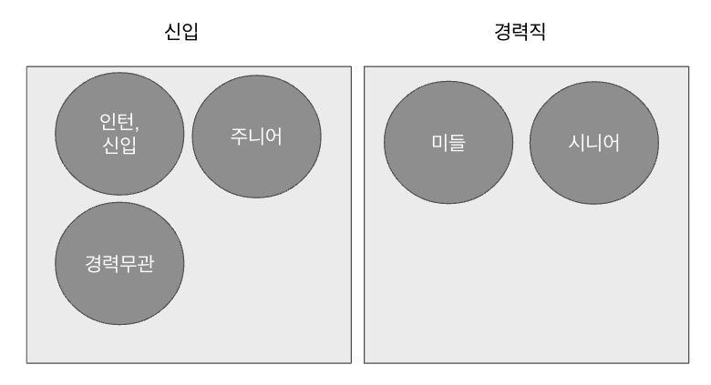

# ts-jenum 으로 응집력 있는 TS 코드 작성하기 (feat. EnumClass)

TypeScript의 Enum은 딱 열거형으로서만 사용할 수 있습니다.    
다른 언어에서 Enum을 Static 객체로 사용해본 경험이 있는 분들이라면 이 지점이 굉장히 답답하다는 것을 느낄 수 있는데요.  

> Java에서 Enum을 객체로 활용하면 어떤 큰 장점을 얻게되는지는 [배민 기술 블로그](https://techblog.woowahan.com/2527/) 를 참고해보시면 좋습니다.

저와 똑같이 답답함을 느끼신 분이 계시는지, 이미 TypeScript도 Java의 Enum과 같이 Static 객체로 Enum을 다룰 수 있도록 `ts-jenum` 을 만들어주셨습니다.  
이번 시간에는 `ts-jenum` 을 이용해 응집력 있는 Enum 활용법을 소개드리겠습니다.  

## 1. 설치

[ts-jenum](https://www.npmjs.com/package/ts-jenum) 은 Java의 `java.lang.Enum` 과 같은 사용성을 얻기 위해 제공하는 라이브러리입니다.  


별도의 데코레이터를 제공하는데, 이를 통해 TS/JS가 가진 Enum의 한계점을 해결합니다.  

설치 방법은 간단합니다.

```bash
npm i ts-jenum
```

## 2. 사용법

기본적인 예제는 [공식 Github](https://github.com/reforms/ts-jenum) 에 나와있습니다.  
그 중 일부를 소개드립니다.  

먼저 ts-jenum을 사용한 클래스는 다음과 같이 생성할 수 있습니다.

```javascript
import { Enum, EnumType } from 'ts-jenum';

@Enum('code') // (1)
export class EJobLevel extends EnumType<EJobLevel>() { // (2)
    // (3)
    static readonly IRRELEVANT = new EJobLevel("IRRELEVANT", '경력무관', 0, 99,);
    static readonly BEGINNER = new EJobLevel("BEGINNER", '인턴/신입', 0, 0,);
    static readonly JUNIOR = new EJobLevel("JUNIOR", '주니어', 1, 3);
    static readonly MIDDLE = new EJobLevel("MIDDLE", '미들', 4, 7);
    static readonly SENIOR = new EJobLevel("SENIOR", '시니어', 8, 20);

    private constructor(readonly _code: string, readonly _name: string, readonly _startYear, readonly _endYear,) {
        super();
    }
}
```

> 저는 Enum과 구분하기 위해서 ts-jenum 클래스는 prefix로 `E`를 붙여서 사용하고, 지칭은 EnumClass라고 합니다.  
> ex) `Enum: JobLevel`, `ts-jenum: EJobLevel`

이후 오해를 막기 위해 `ts-jenum` 으로 만들어진 클래스들은 **EnumClass**라고 하겠습니다.

(1) `@Enum('필드명')`
* **EnumClass 메인 Key**가 될 필드를 지정합니다.
    * 여기서는 `_code` 필드의 **getter 메소드**인 `code`를 메인 Key로 사용합니다.
* 해당 Key는 **절대 중복이 되어선 안됩니다**
  * EnumClass의 `static class` 들의 구분자 역할을 하기 때문입니다.

(2) `extends EnumType<EJobLevel>()`

* `ts-jenum` 이 제공하는 EnumType을 꼭 상속 받아야합니다.
* 이때 EnumType는 제네릭 타입으로 **상속받은 EnumClass를 꼭 사용해야합니다**
  * EnumClass 에서 제공하는 여러 편의 메소드들 (`find`, `values`, `valueByName` 등등)을 사용할때 타입 명시가 필요하기 때문입니다.

(3) `static readonly IRRELEVANT ~~`

* Enum 타입을 선언하듯이 **EnumClass의 타입**을 선언합니다.
* 여기서 선언된 `IRRELEVANT`, `BEGINNER`, `JUNIOR`, `MIDDLE`, `SENIOR` 등이 EnumClass의 타입으로 작동합니다.

이렇게 작성된 EnumClass는 다음과 같이 활용 가능합니다.  
(간단하게 테스트 코드로 각 기능들을 검증했습니다.)

```javascript
it('ts-jenum 기본 케이스 검증', () => {
  // toString은 @Enum() 에 선언된 필드를 사용한다
  expect('' + JobLevel.IRRELEVANT).toBe(JobLevel.IRRELEVANT.code);

  // values() 는 전체 EnumClass를 반환한다
  expect(JobLevel.values()).toStrictEqual([
    JobLevel.IRRELEVANT,
    JobLevel.BEGINNER,
    JobLevel.JUNIOR,
    JobLevel.MIDDLE,
    JobLevel.SENIOR,
  ]);

  // valueOf는 @Enum() 에 선언된 필드를 통해 찾을 수 있다
  expect(JobLevel.valueOf('MIDDLE')).toBe(JobLevel.MIDDLE);

  // valueByName 는 실제 static 클래스이름으로 찾을 수 있다
  expect(JobLevel.valueByName('MIDDLE')).toBe(JobLevel.MIDDLE);

  // enumName은 static 클래스명이 반환된다
  expect(JobLevel.MIDDLE.enumName).toBe('MIDDLE');

  // find는 람다표현식으로 EnumClass들 사이에서 원하는 대상을 하나 찾을 수 있다.
  expect(JobLevel.find((e) => e.name === '미들')).toBe(JobLevel.MIDDLE);

  // filter는 람다표현식으로 EnumClass들 사이에서 원하는 대상들 여러개를 찾을 수 있다.
  expect(
    JobLevel.filter((e) => e.name === '주니어' || e.name === '미들'),
  ).toStrictEqual([JobLevel.JUNIOR, JobLevel.MIDDLE]);
});
```

이 외에도 다양한 기능이 지원되니 [공식 Github](https://github.com/reforms/ts-jenum) 을 찾아보면 좋습니다.

## 3. 예제

실제 사례를 통해 한번 EnumClass를 어떻게 활용하면 좋을지 소개드리겠습니다.  
예제에서 사용될 EnumClass 입니다.

```js
import { Enum, EnumType } from 'ts-jenum';

@Enum('code')
export class JobLevel extends EnumType<JobLevel>() {
  static readonly IRRELEVANT = new JobLevel('IRRELEVANT', '경력무관', 0, 99);
  static readonly BEGINNER = new JobLevel('BEGINNER', '인턴/신입', 0, 0);
  static readonly JUNIOR = new JobLevel('JUNIOR', '주니어', 1, 3);
  static readonly MIDDLE = new JobLevel('MIDDLE', '미들', 4, 7);
  static readonly SENIOR = new JobLevel('SENIOR', '시니어', 8, 20);

  private constructor(
    readonly _code: string,
    readonly _name: string,
    readonly _startYear,
    readonly _endYear,
  ) {
    super();
  }

  get code(): string {
    return this._code;
  }

  get name(): string {
    return this._name;
  }

  get startYear(): number {
    return this._startYear;
  }

  get endYear(): number {
    return this._endYear;
  }

  static findName(code: string): string {
    return this.values().find((e) => e.equals(code))?.name;
  }

  static findByYear(year: number): JobLevel {
    return this.values().find(
      (e) => e.betweenYear(year) && e !== this.IRRELEVANT,
    );
  }

  betweenYear(year: number): boolean {
    return this.startYear <= year && this.endYear >= year;
  }

  getPeriod(): string {
    return `${this.startYear} ~ ${this.endYear}`;
  }

  equals(code: string): boolean {
    return this.code === code;
  }

  toCodeName() {
    return {
      code: this.code,
      name: this.name,
    };
  }
}
```

### 3-1. 데이터들간 연관 관계 정리

이를테면 데이터베이스에 저장된 영문자 `BEGINNER` 은 화면에서는 `인턴/신입`로 노출되어야 한다고 가정해봅니다.  
이뿐만 아니라 `IRRELEVANT(경력무관)` `JUNIOR(주니어)` `MIDDLE(미들)` `SENIOR(시니어)` 도 마찬가지로 한세트의 데이터들입니다.  

이럴 경우 리터럴 객체도 좋은 해결책이지만, **타입힌트 / 자동완성 / 상속 or 구성** 등의 확장성까지 고려한다면 클래스로 추출하기 좋은 사례인데요.  
지금처럼 **미리 정의된 데이터 세트**안에서만 활동한다면 `ts-jenum` 의 EnumClass가 많은 도움이 됩니다.

```javascript
@Enum('code')
export class JobLevel extends EnumType<JobLevel>() {
  static readonly IRRELEVANT = new JobLevel('IRRELEVANT', '경력무관', 0, 99);
  static readonly BEGINNER = new JobLevel('BEGINNER', '인턴/신입', 0, 0);
  static readonly JUNIOR = new JobLevel('JUNIOR', '주니어', 1, 3);
  static readonly MIDDLE = new JobLevel('MIDDLE', '미들', 4, 7);
  static readonly SENIOR = new JobLevel('SENIOR', '시니어', 8, 20);

  ....
}
```

그리고 이렇게 관련된 데이터들을 묶어서 API로 모두 다 함께 내려줘야한다면 다음과 같이 **클래스의 메소드**로 쉽게 변환이 가능합니다.

```javascript
@Enum('code')
export class JobLevel extends EnumType<JobLevel>() {
  ....
  toCodeName() {
    return {
      code: this.code,
      name: this.name,
    };
  }
}
```

### 3-2. 상태와 행위 한 곳에서 관리하기

이를테면, 다음과 같은 도메인 로직이 있다고 가정해봅니다.

* 경력무관: 0 ~ 99 년차
* 신입/인턴: 0년차
* 주니어: 1~3년차
* 미들: 4 ~ 7년차
* 시니어: 8 ~ 20년차

이때 **해당 사용자의 연차를 기준으로 등급이 어떻게 되는지** 확인 하는 기능이 필요하다면 어떻게 해야할까요?  
가장 무난한 방법은 다음과 같이 `if / switch` 로 코드를 작성하는 것입니다.

```javascript
getJobLevel(workYear) {
  if(workYear === 0) {
    return '신입/인턴';
  } else if (workYear >= 1 && workYear <= 3) {
    return '주니어';
  } else if (workYear >= 4 && workYear <= 7) {
    return '미들';
  } else if (workYear >= 8 && workYear <= 20) {
    return '시니어';
  } else {
    return '경력무관';
  }
}
```

이런 코드는 **응집력 있는 코드가 아닙니다**.  
이후에 경력 (`workYear`) 에 따른 구분값과 도메인 로직이 필요할때마다 파현화된 함수들이 계속 추가될 뿐입니다.  

이 역시 EnumClass를 활용한다면 다음과 같이 **상태와 로직을 한 곳에서** 관리할 수 있는데요.

```javascript
@Enum('code')
export class JobLevel extends EnumType<JobLevel>() {
  static readonly IRRELEVANT = new JobLevel('IRRELEVANT', '경력무관', 0, 99);
  static readonly BEGINNER = new JobLevel('BEGINNER', '인턴/신입', 0, 0);
  static readonly JUNIOR = new JobLevel('JUNIOR', '주니어', 1, 3);
  static readonly MIDDLE = new JobLevel('MIDDLE', '미들', 4, 7);
  static readonly SENIOR = new JobLevel('SENIOR', '시니어', 8, 20);
  ...

  // 전체 JobLevel 중 해당 연차에 포함되는 JobLevel 탐색
  static findByYear(year: number): JobLevel {
    return this.values().find(
      (e) => e.betweenYear(year) && e !== this.IRRELEVANT,
    );
  }

  // 해당 JobLevel의 연차 범위내에 포함되는지 확인
  betweenYear(year: number): boolean {
    return this.startYear <= year && this.endYear >= year;
  }
  ...
}
```

이렇게 되면 다음과 같이 `JobLevel.findByYear(workYear)` 한 줄로 **연차로 역량 레벨 조회**를 할 수 있습니다

```javascript
it.each([
  [0, '인턴/신입'],
  [1, '주니어'],
  [5, '미들'],
  [11, '시니어'],
])('연차 %s인 경우 역량 등급은 %s이다', (year, grade) => {
  const result = JobLevel.findByYear(Number(year));

  expect(result.name).toBe(grade);
});
```

### 3-3. 데이터 그룹 관리하기

만약 **채용 공고 작성**을 위해 인턴부터 시니어까지의 레벨을 묶어서 크게 신입/경력직 구분이 필요하다고 가정해보겠습니다.



이를 가장 쉽게 푸는 방법은 (또?) `if ~ else` 와 같이 작성하는 것인데요.

```javascript

getJobLevelGroup(jobLevel: string) {

  if(jobLevel === 'BEGINNER' || jobLevel === 'JUNIOR' || jobLevel === 'IRRELEVANT') {
    return 'NEWCOMER'; // 신입
  } else if (jobLevel === 'MIDDLE' || jobLevel === 'SENIOR') {
    return 'EXPERIENCED'; // 경력
  } else {
    throw new Error ('해당하는 그룹이 없습니다.');
  }
}
```

이와 같이 작성할 경우 여러가지 문제가 발생합니다.

* 역량 레벨 & 역량레벨그룹 둘의 관계를 파악하기가 어렵습니다.
  * 위 함수는 **포함관계**를 나타내는 것일까요? 아니면 **단순한 대체값**을 리턴한것일까요?
  * 도메인 로직상으로는 **레벨별 그룹을 만들어 포함 관계**인데, 위 같은 함수만으로는 표현이 불가능합니다.
* 입력값과 결과값이 예측 불가능합니다.
  * 역량 레벨 의 범위를 지정할수 없어서 **문자열이면 전부 파라미터로 전달** 될 수 있습니다.
  * 마찬가지로 **이 함수의 결과를 받는 쪽에서도 문자열을 받기 때문에** 역량 레벨로 지정된 값만 받을 수 있도록 검증함수가 추가로 필요하게 됩니다.
* 그룹별 기능을 추가하기가 어렵습니다.
  * 역량 레벨 그룹에 따라 추가적인 기능이 필요할 경우 현재 상태라면 어떻게 구현 할수 있을까요?

이런 경우 역시 역량 레벨 (JobLevel)과 역량 레벨 그룹 (JobLevelGroup) 으로 EnumClass를 각자 만들어 **둘의 관계를 포함**시키도록 구성하면 쉽게 해결할 수 있습니다.  
(JobLevel은 위에서 생성해두었으니, 여기서는 JobLevelGroup만 생성합니다.)

```javascript
@Enum('code')
export class JobLevelGroup extends EnumType<JobLevelGroup>() {
  static readonly NEWCOMER = new JobLevelGroup('NEWCOMER', '신입', [
    JobLevel.BEGINNER,
    JobLevel.JUNIOR,
    JobLevel.IRRELEVANT,
  ]);

  static readonly EXPERIENCED = new JobLevelGroup('EXPERIENCED', '경력직', [
    JobLevel.MIDDLE,
    JobLevel.SENIOR,
    JobLevel.IRRELEVANT,
  ]);

  private constructor(
    readonly _code: string,
    readonly _name: string,
    readonly _jobLevels: JobLevel[],
  ) {
    super();
  }

  // 미리 static Map이나 리터럴 객체를 만들어 두면 매번 values 순회하는 것을 방지할 수도 있습니다.
  static findByJobLevel(jobLevel: JobLevel): JobLevelGroup {
    return this.values().find((group) =>
      group._jobLevels.some((level) => level.equals(jobLevel)),
    );
  }

  get code(): string {
    return this._code;
  }
}
```

이렇게 작성할 경우 아래와 같이 역량레벨에 맞춰 그룹을 찾을 수 있습니다.

```javascript
it('JobLevel로 JobLevelGroup를 찾는다', () => {
  const jobLevel = JobLevel.MIDDLE;
  const result = JobLevelGroup.findByJobLevel(jobLevel);

  expect(result).toBe(JobLevelGroup.EXPERIENCED);
});
```

그리고 이후에 필요한 로직 혹은 상태가 있을때마다 JobLevel / JobLevelGroup에 책임에 맞춰 추가하여 응집력을 유지하고 **객체간의 관계가 설정되는 코드**를 작성할 수 있습니다.

## 4. 마무리

[이전 글](https://techblog.woowahan.com/2527/)에도 작성했던 것처럼, ts-jenum의 EnumClass는 **다른 언어의 Enum과 같은 장점**을 얻게 해줍니다.

* A값과 B값이 실제로는 동일한 것인지, 전혀 다른 의미인지,  
* 이 코드를 사용하기 위해 추가로 필요한 메소드들은 무엇인지
* 변경되면 어디까지 변경해야하는 것인지 등등

불확실한 것들이 너무 많았던 상황에서 EnumClass을 통해 확실한 부분과 불확실한 부분을 분리할 수 있었습니다.  

특히 가장 실감했던 장점은 **문맥(Context)을 담는다**는 것 이였습니다.  
A라는 상황에서 "a"와 B라는 상황에서 "a"는 **똑같은 문자열 "a"지만 전혀 다른 의미**입니다.  
문자열은 이를 표현할 수 없지만, Enum (EnumClass)은 이를 표현할 수 있었습니다.
이로 인해 실행되는 코드를 이해하기 위해 추가로 무언가를 찾아보는 행위를 최소화 할 수 있게 되었습니다.  

라이브러리 특성상 프론트엔드에서 활용하기에는 어려움이 있겠지만, 복잡한 관계 속에서 **연관된 데이터들간의 상태와 행위를 응집력 있게** 관리할때 'ts-jenum' 은 충분한 장점을 가지고 있습니다.  
