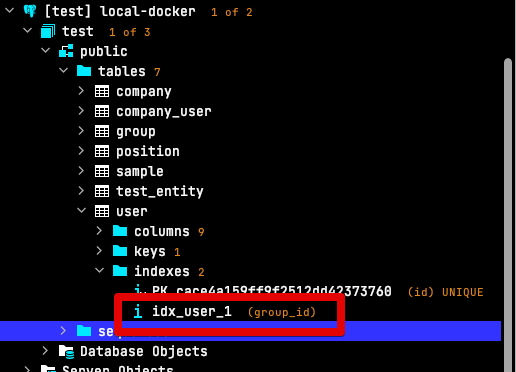

# TypeORM에서 연관관계 유지한채 FK만 제거하기 (w. NestJS)

데이터베이스의 FK (Foreign Key) 는 **데이터 일관성을 적용**하여 데이터베이스를 깨끗하게 유지한다는 큰 장점을 가지고 있습니다.  

다만, 서비스의 규모가 커져 테이블당 row가 1억건이 돌파하는 시점부터는 FK는 많은 변경의 병목이 되는데요.  

이유는 1억건 이상일 경우 `alter table` 로는 3~5시간씩 수행 되기 때문입니다.  
이 시간동안 테이블 Lock이 발생할 수 있으며, 이를 회피하기 위해 아래와 같은 여러 장치들이 지원됩니다.

* [Online DDL](https://myinfrabox.tistory.com/61)
* [Percona pt-online-schema-change](https://jojoldu.tistory.com/358)

다만, FK가 있을 경우 테이블 복사, pt-online-schema 등에서 제약들이 발생하기도 하여서 일정 규모 이상의 서비스에서는 DBA분들의 요청으로 FK를 제거해서 사용하기도 하는데요.  

> 물론 서비스가 작고 DBA분들이 없다면 FK를 통해서 데이터 무결성을 지키는게 훨씬 좋다고 봅니다.

그래서 TypeORM을 사용할 경우에도 마찬가지로 FK가 제거된 형태의 Entity를 구성해야만 합니다.  
N:1 관계를 유지하면서 FK 제약조건만 제거된 형태를 구성하는 방법을 알아보겠습니다.

## 사용법

사용법 자체는 간단합니다.  
아래와 같이 `createForeignKeyConstraints` 옵션을 `false`로 두는 것입니다.

```typescript
@ManyToOne(type => Person, {
  createForeignKeyConstraints: false
})
```

실제 Entity로 한다면 다음과 같이 구성할 수 있습니다.

```typescript
@Entity()
@Index('idx_user_1', ['group']) // (1)
export class User extends BaseTimeEntity {
  @PrimaryGeneratedColumn()
  id: number;

  ...

  // (2)
  @ManyToOne(() => Group, {
    createForeignKeyConstraints: false,
  })
  @JoinColumn({ name: 'group_id', referencedColumnName: 'id' })
  group: Group;

}
```

(1) `@Index('idx_user_1', ['group'])`

* MySQL, PostgreSQL 같은 경우에는 FK를 생성하면 **인덱스도 함께 생성** 됩니다.
* 그러다보니 FK를 생성하지 않으면 해당 컬럼의 인덱스를 꼭 필수로 생성해야 `ManyToOne` 등의 연관관계 조회에서 성능 이슈를 겪지 않습니다.
* 인덱스 대상은 **테이블 컬럼이 아닌 Entity 필드**를 사용합니다 (`group_id`가 아닌 `group`)
* 이렇게 하더라도 아래와 같이 마이그레이션에서는 정상적으로 `group_id` 컬럼으로 지정됩니다.



(2) `@ManyToOne ~ @JoinColumn`

* 위에서 언급한대로 `createForeignKeyConstraints: false,` 를 통해 FK 제약조건은 제거합니다.
* 저같은 경우엔 `@OneToOne` 외에도 `@ManyToOne` 에서도 꼭 `@JoinColumn`을 선언해줍니다.
* 실제 생성될 테이블의 모습이 어느정도 예측 가능 범위 내에 있어야하고, 이후 인덱스 튜닝등이 필요해 복합 컬럼 인덱스를 만들어야할때가 있어 이때 어느 컬럼을 잡아야할지 알 수 있습니다.
