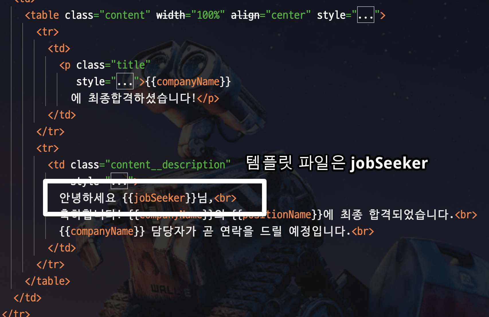
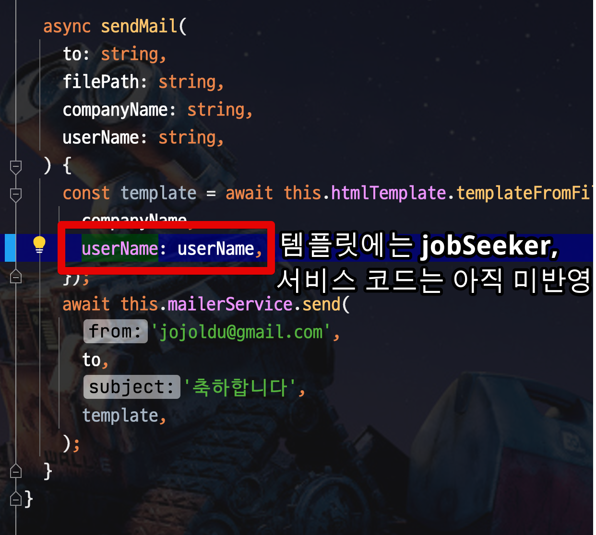

# 메세지의 템플릿 내용 단위 테스트 하기


## 1. 문제

서비스를 개발하다보면 특정 포맷으로 이메일을 보내거나, 문자등을 보내는 기능을 구현할때가 있다.
이를 테면 다음과 같은 경우이다.

* 메일/카카오톡/문자 등으로 보내는 템플릿 내용
* SQS와 같은 메세지큐에 보내는 메세지 내용
* 비지니스 담당자가 봐야하는 로그

이런 경우 보통 **메세지 내용을 검증하기가 상당히 어렵다**  
예를 들어 다음과 같은 `sendMail` 코드가 있다면

```js
@Injectable()
export class AdminService {
    constructor(
        private readonly mailerService: MailerService,
        private readonly htmlTemplate: HtmlTemplate,
    ) {}

    async sendMail(
        email: string,
        filePath: string,
        companyName: string,
        userName: string,
    ) {
        const template = await this.htmlTemplate.templateFromFile(filePath, {
            companyName,
            jobSeeker: userName,
        });
        await this.mailerService.send(
            'jojoldu@gmail.com',
            email,
            '축하합니다',
            template,
        );
    }
}
```

> 메일 발송의 본문을 위한 `HtmlTemplate` 코드는 이전에 작성된 [Mustache.js 로 이메일 템플릿 구성하기](https://jojoldu.tistory.com/618) 를 참고하면 된다.


여기서 `const template = await this.htmlTemplate.templateFromFile` 의 결과를 검증하기가 쉽지 않다.  
크게 2가지 이유가 있다.

* `sendMail` 메소드는 return이 없이 **메일을 발송**하는 기능이라, 실제 메일을 수신해서 테스트 코드로 검증하는 것은 불가능하다
* 해당 메소드의 **템플릿 생성 부분을 별도의 함수로 추출한다고 해도 결국 private 메소드**이다.  
  * 테스트를 위해 `private` 메소드를 `public` 으로 열어둘 순 없다. 

그러다보니 저 부분을 검증하지 못하다가 큰 사고가 나기도 한다.  
  
이메일의 본문에 해당하는 템플릿 파일에서는 변수를 `jobSeeker`로 변경하였지만,



템플릿 데이터에서는 아직 `userName` 으로 그대로 두고 발견하지 못한채 배포를 해버릴 수도 있다. 



그렇다면 어떻게 하면 이메일 발송에서 내부에서 호출하는 템플릿 내용을 검증할 수 있을까?

## 2. 해결

이 부분은 통합테스트나 E2E 테스트와 관계없이 단위 테스트로 해결이 가능하다.  
다음과 같이 **메일을 발송하는 부분을 테스트 더블로 교체**하는 것이다.

```js

// 전달받은 이메일 항목을 실제 메일 발송을 하지 않고, 클래스 내부 멤버 변수에 담아둔다
class StubMailerService extends MailerService {
    subject: string;
    content: string;
    async send(
        from: string,
        to: string,
        subject: string,
        content: string,
    ): Promise<void> {
        this.subject = subject;
        this.content = content;
    }
}

describe('AdminService', () => {
    it('email template 검증', async () => {
        const spy = new StubMailerService();
        const service = new AdminService(spy, new HtmlTemplate());

        const companyName = '인프랩';
        const userName = '테스트유저';
        await service.sendMail('test@gmail.com', 'sample', companyName, userName);
        
        // StubMailerService 에 담겨진 이메일 내용을 검증한다 
        expect(spy.subject).toBe('축하합니다');
        expect(spy.content).toContain(companyName);
        expect(spy.content).toContain(userName);
    });
});
```

(1) 실제 이메일 발송을 하지 않고, 클래스 멤버 변수에 항목 전체를 담아두는 `StubMailerService` 를 만들어둔다 
(2) `AdminService`에서 사용하는 `MailerService`를 `StubMailerService` 로 교체한다
(3) `AdminService` 의 `sendMail` 을 호출하면 템플릿 결과가 `StubMailerService` 에 저장된다
(4) `StubMailerService` 의 내부에 담긴 결과를 검증한다

이렇게 할 경우 **이메일 발송을 위해 만들어진 모든 항목을 외부 의존성 없이 검증**할 수 있게 된다.
